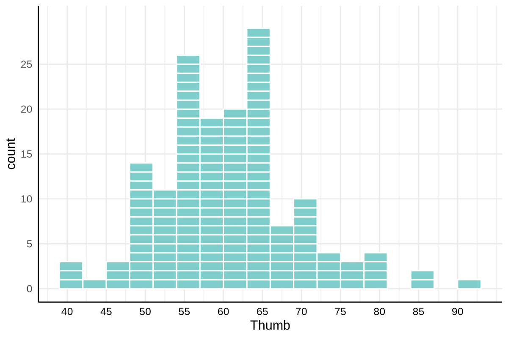
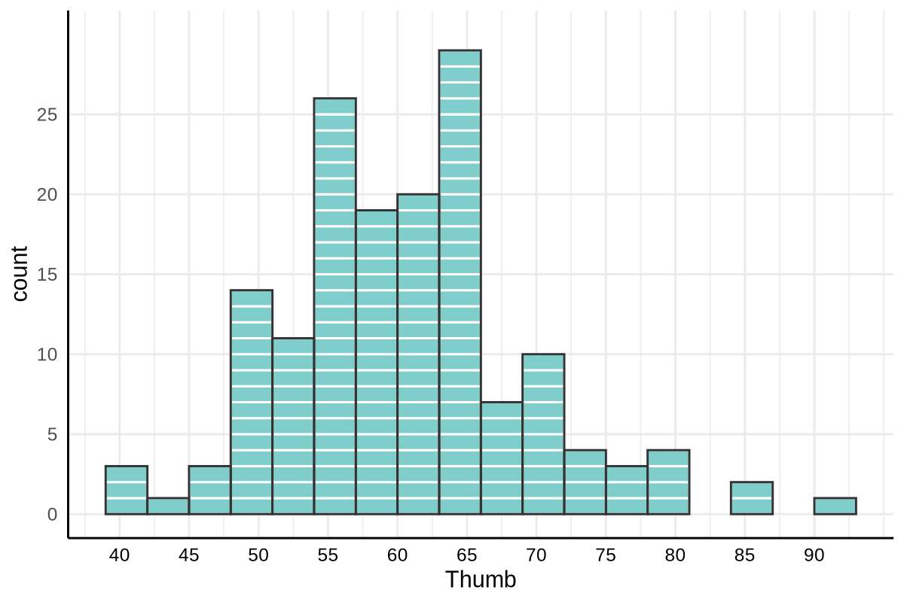

# Introducing `gf_squareplot`: A Countable Histogram

Beginning statistics students often have trouble interpreting histograms. The concept of binning is not obvious. Also not obvious is the fact that the height of the bars represents the count of cases that fall within each bin. The `gf_squareplot()` function offers a version of a histogram where you can actually *count* the individual observations.



## What Makes It Different?

Instead of abstract bars, `gf_squareplot` displays each data point as a small stacked rectangle. Students can literally count the squares in each bin, making sample size and distribution shape concrete and tangible. It's particularly useful for sampling distributions where n might be 50 or 100—small enough that individual observations matter.

## Basic Usage

The function follows the familiar ggformula interface:

```r
gf_squareplot(~x, data = df)
```

To help students transition to canonical histograms, you can also add bar outlines to visually group the squares:

```r
gf_squareplot(~x, data = df, bars = "outline")
```

For example, `gf_squareplot(~ Thumb, data = Fingers, bars="outline", binwidth=3)`



For larger samples (over 1000 observations), the function automatically switches to solid bars to keep things readable.

## Key Arguments

### Data and Appearance

| Argument | Description |
|----------|-------------|
| `x` | A formula like `~variable`, or a numeric vector |
| `data` | Your data frame (required when using a formula) |
| `fill` | Rectangle color (default: `"#7fcecc"`, a pleasant teal) |
| `alpha` | Transparency from 0 to 1 |
| `bars` | Display style: `"none"` (squares only), `"outline"` (adds bar borders), or `"solid"` (filled bars, i.e., a normal histogram) |

### Binning Control

| Argument | Description |
|----------|-------------|
| `binwidth` | Width of each bin (auto-calculated if not specified) |
| `origin` | Where binning starts |
| `boundary` | Alternative to `origin`—sets a bin boundary position |

### Axis Control

| Argument | Description |
|----------|-------------|
| `xbreaks` | Either a single number (approximate count of breaks) or a vector of specific positions |
| `xrange` | Set x-axis limits as `c(min, max)` |
| `mincount` | Minimum y-axis height—useful for keeping scales consistent across multiple plots |

Note that `xbreaks` uses R's `pretty()` function under the hood, so if you ask for 10 breaks you might get 8 or 12. For exact control, pass a specific vector like `xbreaks = seq(-30, 30, by = 5)`.

## The DGP Overlay: Teaching Sampling Distributions and Hypothesis Testing

Set `show_dgp = TRUE` to add a pedagogical overlay designed for teaching sampling distributions and hypothesis testing. This display is intended to support the CourseKata curriculum, in which sampling distributions are introduced first for a group difference ($b_1$) and the sampling distribution is created using the `shuffle()` function.

```r
gf_squareplot(~b1, data = sampling_dist, 
              show_dgp = TRUE,
              xrange = c(-30, 30),
              mincount = 20)
```

This adds:

- **A top axis** labeled "Population Parameter (DGP)" with the population model equation using Greek letters: Y = β₀ + β₁X + ε
- **A bottom axis** labeled "Parameter Estimate" with the sample equation using Roman letters: Y = b₀ + b₁X + e  
- **A red triangle at zero** on the top axis marking the null hypothesis (β₁ = 0)
- **A blue b₁ label** to label the bottom axis

The visual contrast between the population parameters (what we're trying to learn about) and sample estimates (what we actually observe) reinforces a distinction that students often find confusing.

### Optional: Show the Mean

Add `show_mean = TRUE` to draw a dashed red line at the mean of the sampling distribution—helpful when discussing where sample estimates tend to fall and to show that as the sampling distribution gets larger, its mean approaches the mean of the population.

## Putting It All Together

Here's a complete example for a hypothesis testing demonstration:

```r
# Assume sampling_dist contains b1 values from many simulated samples
gf_squareplot(~b1, data = sampling_dist, 
              bars = "none",
              show_dgp = TRUE,
              show_mean = TRUE,
              xrange = c(-30, 30),
              xbreaks = seq(-30, 30, by = 10),
              mincount = 25,
              fill = "#7fcecc")
```

## Teaching Tips

- The countable squares make abstract concepts concrete—students can see that "n = 47" means 47 actual squares
- Use `mincount` when comparing multiple sampling distributions to keep the y-axis consistent
- The DGP overlay explicitly distinguishes population parameters (Greek) from sample estimates (Roman letters)—a distinction worth emphasizing repeatedly
- Warning messages are automatically suppressed so your classroom display stays clean

## A Note on Large Samples

When your data has more than 1000 observations, the function automatically switches to solid bars. At that scale, individual squares become too small to count anyway, and solid bars render much faster.

---

Happy teaching! The function is designed to make the invisible visible—turning abstract statistical concepts into something students can point at and count.
