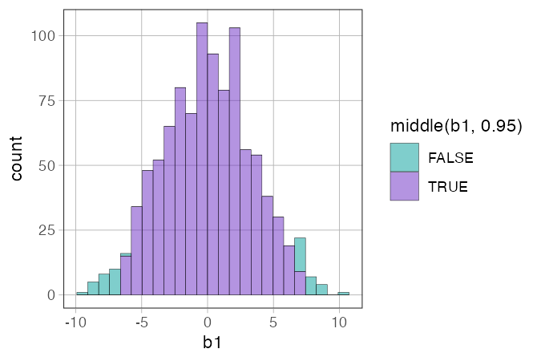
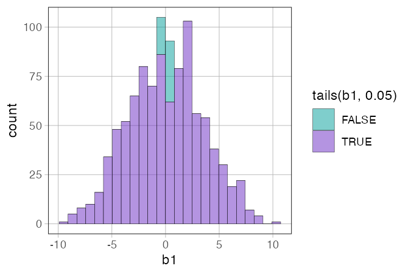
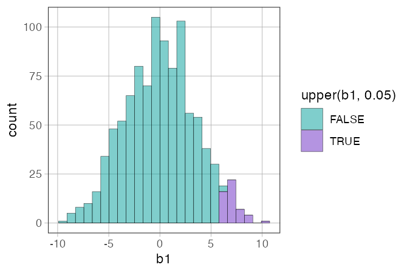
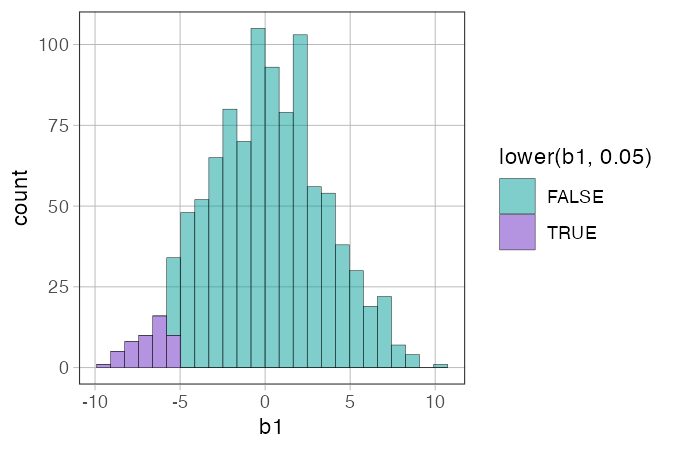
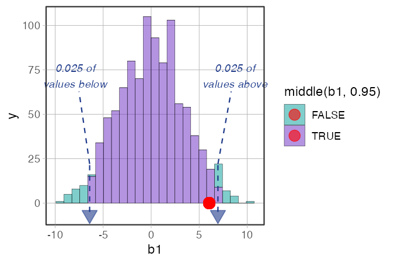
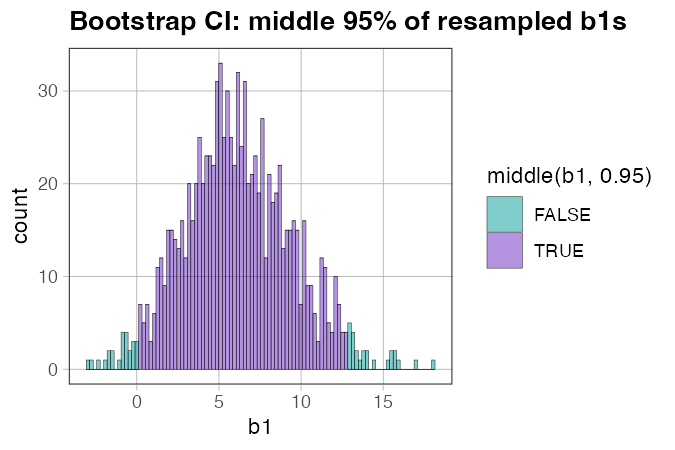

# Distribution-part functions — `middle()`, `tails()`, `upper()`, `lower()`, `outer()`

**Source:** [`library(coursekata)`](https://github.com/coursekata/coursekata-r)

---

## What they do

The distribution-part functions take a vector of values and return a logical vector (`TRUE`/`FALSE`) indicating which values fall in a specified region of the distribution. They are almost always used as the `fill` aesthetic inside `gf_histogram()` to color different parts of a histogram.

```r
gf_histogram(~ b1, data = sdob1, fill = ~ middle(b1, .95))
```

Each bin that contains values in the specified region gets one color; the rest get another. This lets students *see* which outcomes are "likely" vs. "unlikely" under a given model.

---

## The five functions at a glance

| Function | Colors… | `prop` means… |
|---|---|---|
| `middle(x, prop)` | the central `prop` of values | proportion *included* |
| `tails(x, prop)` | the outer `prop` of values (both tails) | proportion *excluded* from middle |
| `upper(x, prop)` | the top `prop` of values | proportion in the upper tail |
| `lower(x, prop)` | the bottom `prop` of values | proportion in the lower tail |
| `outer(x, prop)` | both tails, `prop/2` each | total proportion in both tails |

`middle()` and `tails()` are complements: `middle(x, .95)` colors exactly what `tails(x, .05)` does not.

`outer()` is an alias for `tails()` with the proportion flipped: `outer(x, .05)` ≡ `tails(x, .95)`. It was introduced to let students express "the outer 5%" without having to think about the complement.

---

## Usage

```r
library(coursekata)

# Build a sampling distribution
set.seed(42)
sdob1 <- do(1000) * b1(shuffle(Tip) ~ Condition, data = TipExperiment)

# Color the middle 95% (the "likely" region at α = .05)
gf_histogram(~ b1, data = sdob1, fill = ~ middle(b1, .95))
```

---

## Examples

### `middle()` — color the likely region

The most common use. Shows students the central bulk of the sampling distribution — what b1 values we'd expect to see often if the empty model were true.

```r
set.seed(42)
sdob1 <- do(1000) * b1(shuffle(Tip) ~ Condition, data = TipExperiment)

gf_histogram(~ b1, data = sdob1, fill = ~ middle(b1, .95))
```



*What to look for:* The colored (teal) bins are the middle 95% of shuffled b1 values. The uncolored bins are the most extreme 5% — the region we've agreed (at α = .05) to call "unlikely."

---

### `tails()` — color the unlikely region

The same cutoffs as `middle(.95)`, but the coloring is flipped — now the *tails* are highlighted instead of the middle. Some instructors find this easier to read when the pedagogical focus is on "what counts as extreme?"

```r
gf_histogram(~ b1, data = sdob1, fill = ~ tails(b1, .05))
```



*What to look for:* The colored bins are the 5% most extreme values. `tails(b1, .05)` and `middle(b1, .95)` mark the same boundary — just with opposite coloring.

---

### `upper()` — one-tailed test, upper direction

For directional hypotheses where you predicted the effect would be *positive*. Only the top 5% is colored.

```r
gf_histogram(~ b1, data = sdob1, fill = ~ upper(b1, .05))
```



*What to look for:* Only one tail is shaded. This is appropriate when you had a prior prediction about direction — e.g., "the tip condition increases tips." The full α = .05 goes into a single tail rather than being split .025/.025.

---

### `lower()` — one-tailed test, lower direction

For directional hypotheses where you predicted the effect would be *negative*.

```r
gf_histogram(~ b1, data = sdob1, fill = ~ lower(b1, .05))
```



*What to look for:* Mirror image of `upper()`. Use when your hypothesis specifically predicted a negative b1.

---

### Used with `show_cutoffs()`

The distribution-part functions set up the colored regions; `show_cutoffs()` adds explicit dashed lines and triangle markers at the boundaries.

```r
obs_b1 <- b1(Tip ~ Condition, data = TipExperiment)

gf_histogram(~ b1, data = sdob1, fill = ~ middle(b1, .95)) %>%
  show_cutoffs(labels = TRUE) %>%
  gf_point(0 ~ obs_b1, color = "red", size = 4)
```



*What to look for:* The full hypothesis testing visual: colored regions (what's likely), dashed cutoff lines (the α boundary), labels (the tail proportion), and the observed b1 as a red dot. Students can immediately see whether the observed value falls inside or outside the unlikely region.

---

### Confidence intervals with `resample()`

The same `middle()` pattern works for bootstrap confidence intervals — just replace `shuffle()` with `resample()`.

```r
set.seed(42)
sdob1_boot <- do(1000) * b1(Tip ~ Condition, data = resample(TipExperiment))

gf_histogram(~ b1, data = sdob1_boot, fill = ~ middle(b1, .95), bins = 100)
```



*What to look for:* Now the colored region is a 95% confidence interval — the range of b1 values consistent with the data. The interpretation flips: instead of asking "is our observed b1 unlikely under the empty model?", we're asking "what range of true β1 values does our data support?"

---

## Arguments

All five functions share the same argument structure:

| Argument | Default | Description |
|---|---|---|
| `x` | *(required)* | The vector of values (typically a column in a data frame). |
| `prop` | `0.95` for `middle()`/`tails()`; `0.025` for `upper()`/`lower()` | The proportion of values to include in the colored region. See table above for what "proportion" means for each function. |
| `greedy` | `TRUE` | When the cutoff falls between two values, `greedy = TRUE` includes the extra value (rounds up). Rarely needs to be changed. |

---

## Teaching tips

- **Introduce `middle()` first.** It matches the most natural question: "what values do we usually see?" Students understand "the middle 95%" more intuitively than "the outer 5%."
- **`middle(.95)` and `tails(.05)` tell the same story with different emphasis.** Show both framings. "The middle 95% is likely" and "the outer 5% is unlikely" are the same fact — but one focuses on the typical, the other on the extreme.
- **The `prop` argument in `middle()` is the proportion you *keep*, not the alpha level.** `middle(b1, .95)` corresponds to α = .05. Students sometimes confuse these — it's worth being explicit.
- **`upper()` and `lower()` are for directional hypotheses.** Introduce them only after students have internalized the two-tailed case. The key idea: if you predicted direction in advance, all of your α goes into one tail.
- **Use `show_cutoffs()` to make the boundaries visible.** The color contrast alone can be hard to read in some palettes; the dashed lines and triangle markers make the cutoffs unambiguous.

---

## How they fit with the other functions

```r
# Hypothesis test (shuffle)
sdob1 <- do(1000) * b1(shuffle(Tip) ~ Condition, data = TipExperiment)
gf_histogram(~ b1, data = sdob1, fill = ~ middle(b1, .95)) %>%
  show_cutoffs(labels = TRUE) %>%
  gf_point(0 ~ obs_b1, color = "red", size = 4)

# Confidence interval (resample)
sdob1_boot <- do(1000) * b1(Tip ~ Condition, data = resample(TipExperiment))
gf_histogram(~ b1, data = sdob1_boot, fill = ~ middle(b1, .95), bins = 100)
```

See also:

- [`show_cutoffs.md`](show_cutoffs.md) — adds dashed lines and triangle markers at the cutoff positions
- [`gf_squareplot.md`](gf_squareplot.md) — countable histogram used earlier in the sampling distribution sequence, also uses `show_dgp` for the DGP overlay
