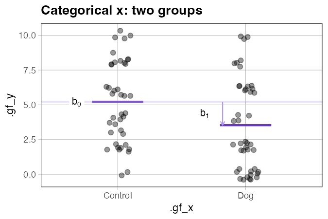
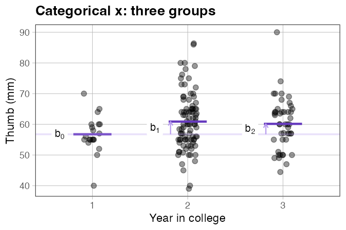
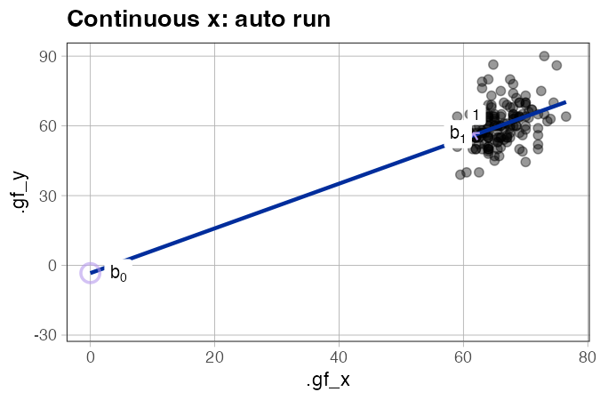
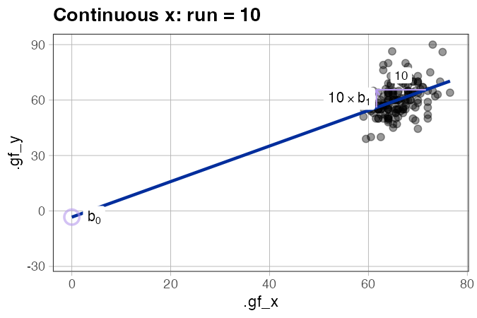
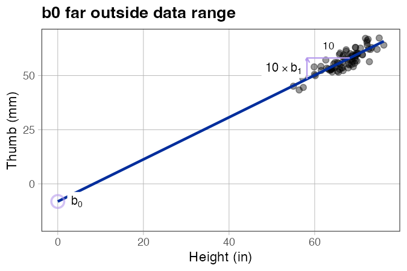
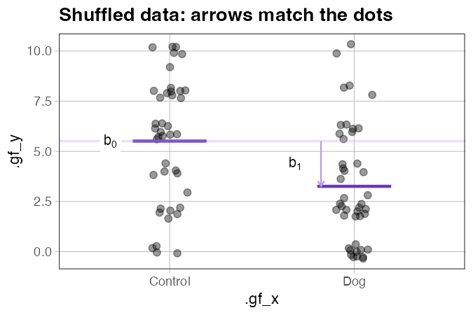
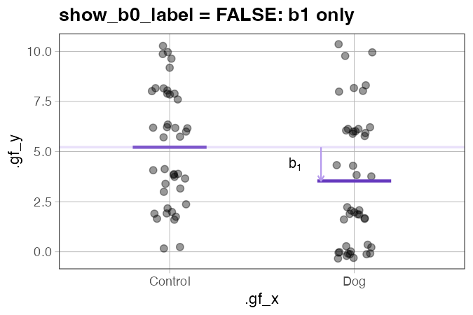
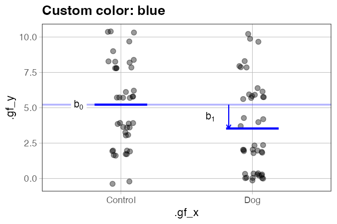

# `gf_coef()` — Overlay model coefficients on a plot

**Also available as:** `gf_b()`  
**Source:** [`gf_coef.R`](../gf_coef.R)

---

## What it does

`gf_coef()` adds a visual annotation of the fitted model's coefficients — b0, b1, b2, … — on top of an existing ggformula plot. The goal is to make the connection between the numbers in a model summary and the picture on the plot concrete and immediate for students.

How the annotation looks depends on the type of x variable:

**Categorical x** — A faint horizontal line marks b0 (the reference group mean). For each other group, a vertical arrow runs from b0 up (or down) to the group's mean, labeled b₁, b₂, … The length of the arrow *is* the coefficient.

**Continuous x** — A rise-over-run right-angle annotation marks b1. A vertical arrow shows the rise; a horizontal segment shows the run. The run unit is auto-selected as a clean power of 10 near 10% of the x-axis span (e.g., if x ranges 60–75, run = 1; if x ranges 0–100, run = 10). b0 is shown as a hollow circle at (x = 0, y = b0), anchored where the regression line crosses the y-axis — even when x = 0 is outside the data range.

`gf_coef()` is **pipe-friendly**: when no model is passed, it builds one automatically from the plot data. This is especially important for shuffle demonstrations, where the arrows and the plotted points must reflect the *same* permutation of the data — which requires knowing the model at draw time.

---

## Usage

```r
# Source the file (not yet in the coursekata package)
source("https://raw.githubusercontent.com/coursekata/beta-functions/refs/heads/main/gf_coef.R")

# With an explicit model
gf_jitter(y ~ x, data = my_data, width = 0.1) %>%
  gf_coef(lm(y ~ x, data = my_data))

# Without a model — gf_coef() fits one from the plot
gf_jitter(y ~ x, data = my_data, width = 0.1) %>%
  gf_coef()

# Alias
gf_jitter(y ~ x, data = my_data) %>%
  gf_b()
```

---

## Examples

### Categorical x: two groups

```r
library(coursekata)
source("gf_coef.R")

gf_jitter(later_anxiety ~ condition, data = er, width = 0.1, alpha = 0.4) %>%
  gf_lm_cat() %>%
  gf_coef()
```



*What to look for:* The faint horizontal line sits at the control group mean (b0). The arrow above (or below) it on the treatment side has length equal to b1.

---

### Categorical x: three groups

```r
Fingers3 <- droplevels(subset(Fingers, Year %in% c("1", "2", "3")))

gf_jitter(Thumb ~ Year, data = Fingers3, width = 0.1, alpha = 0.4) %>%
  gf_lm_cat() %>%
  gf_coef()
```



*What to look for:* Two arrows appear — one for b1 (year 2 vs. year 1) and one for b2 (year 3 vs. year 1). Students can read off the group means as b0, b0 + b1, and b0 + b2.

---

### Continuous x: regression with auto-selected run

```r
gf_point(Thumb ~ Height, data = Fingers, alpha = 0.4) %>%
  gf_lm() %>%
  gf_coef()
```



*What to look for:* The rise arrow is vertical; the run segment is horizontal at the tip of the arrow. The run value (e.g., "1") appears below the run segment; the rise label (e.g., "b[1]") appears to the left. The hollow circle at x = 0 marks b0 — where the line would cross the y-axis — even if x = 0 is far outside the data range.

---

### Continuous x: forcing a specific run unit

```r
gf_point(Thumb ~ Height, data = Fingers, alpha = 0.4) %>%
  gf_lm() %>%
  gf_coef(run = 10)
```



*What to look for:* The rise label changes to "10 × b[1]", making explicit that the arrow's height represents ten times the slope — useful for variables where a 1-unit x change is imperceptibly small.

---

### b0 far outside the data range

```r
# Synthetic data where x ranges ~55–80 and b0 is far below at −3
set.seed(42)
n <- 80
d_far <- data.frame(x = rnorm(n, mean = 67, sd = 4))
d_far$y <- -3 + 0.9 * d_far$x + rnorm(n, sd = 3)

gf_point(y ~ x, data = d_far, alpha = 0.4) %>%
  gf_lm() %>%
  gf_coef()
```



*What to look for:* `gf_coef()` automatically expands the x axis to include x = 0, so the hollow b0 dot is always visible. This makes it clear that b0 is a *mathematical* quantity — the predicted value when x = 0 — not necessarily a meaningful prediction within the data range.

---

### Shuffled data (classroom demonstration)

```r
# Each time this runs, a different permutation is shown —
# but the arrows and dots always match each other.
gf_jitter(shuffle(later_anxiety) ~ condition, data = er, width = 0.1) %>%
  gf_lm_cat() %>%
  gf_coef()
```



*What to look for:* The group-mean segments and the arrows both reflect the shuffled data, not the original. Run this several times and compare to the real-data version — students can see that the coefficients under the null (random shuffle) tend to be much smaller than the real b1.

---

### Hiding b0

```r
gf_jitter(later_anxiety ~ condition, data = er, width = 0.1) %>%
  gf_lm_cat() %>%
  gf_coef(show_b0_label = FALSE)
```



*What to look for:* Only the b1 arrow appears. Useful when you want students to focus on the difference between groups before introducing the intercept.

---

### Custom color

```r
gf_jitter(later_anxiety ~ condition, data = er, width = 0.1) %>%
  gf_lm_cat(color = "blue") %>%
  gf_coef(color = "blue")
```



*Note:* `color` controls arrows, lines, and the b0 dot. Text labels stay black by default (`label_color = "black"`). Pass `label_color = "blue"` to match them too.

---

## How it fits with the other functions

`gf_coef()` is designed to be the last step in a pipe, after the data layer and any model overlay:

```r
gf_jitter(...)       # plot the data
  %>% gf_lm_cat()   # overlay the categorical model (group means)
  %>% gf_coef()     # label the coefficients
```

For continuous x, replace `gf_lm_cat()` with `gf_lm()`:

```r
gf_point(...)        # plot the data
  %>% gf_lm()       # overlay the regression line
  %>% gf_coef()     # label the coefficients
```

See also:

- [`gf_lm_cat.md`](gf_lm_cat.md) — draws horizontal group-mean segments for categorical x models
- [`gf_shuffle_grid.md`](gf_shuffle_grid.md) — builds a grid of shuffled plots for randomization intuition

---

## Arguments

| Argument | Default | Description |
|---|---|---|
| `p` | *(required)* | An existing ggformula or ggplot2 plot. |
| `model` | `NULL` | A fitted `lm()` object. If `NULL`, a model is fit automatically from the plot's data and mapping. |
| `color` | `"#b599ed"` | Color for arrows, lines, and the b0 dot. Does **not** affect text labels. |
| `label_color` | `"black"` | Color for all text labels (b0, b1, run value). Separated from `color` so labels stay readable regardless of arrow color. |
| `b0_color` | `NULL` | Color for the b0 hollow dot (continuous x only). Defaults to `color`. |
| `b0_alpha` | `0.3` | Transparency of the b0 horizontal reference line (categorical x only). |
| `b0_linewidth` | `0.8` | Line width of the b0 horizontal reference line (categorical x only). |
| `b0_size` | `4` | Size of the hollow b0 dot (continuous x only). |
| `arrow_linewidth` | `0.5` | Line width of the b1/b2/… arrows. |
| `label_size` | `3.5` | Font size for all coefficient labels (in ggplot2 `size` units, roughly pt/2.85). |
| `show_b0_label` | `TRUE` | Whether to annotate b0. For categorical x, controls the "b[0]" label on the horizontal line. For continuous x, controls the hollow dot at x = 0. |
| `arrow_nudge` | `0.18` | *(Categorical x)* How far to the left of each group center to place the arrow, in x-axis units. |
| `label_nudge` | `0.08` | *(Categorical x)* Additional leftward offset for the text label relative to the arrow. |
| `run` | `NULL` | *(Continuous x)* Override the auto-selected run unit. E.g., `run = 10` forces a run of 10 x-units. |
| `run_x` | `NULL` | *(Continuous x)* Override the x position where the rise-over-run annotation is placed. |

---

## Known behavior notes

- **`gf_model()` compatibility:** `gf_coef()` is compatible with `gf_model()` (from coursekata/ggformula) as a prior pipe step. The freeze logic correctly identifies `gf_model()`'s layer as a model layer and leaves it untouched.
- **Multiple predictors:** Only b0 and b1 are annotated for continuous x. For categorical x with k groups, b0 through b(k−1) are all annotated.
- **Intercept-only models:** `lm(y ~ 1, data = d)` is supported — a horizontal line at the grand mean is drawn and labeled b0.

