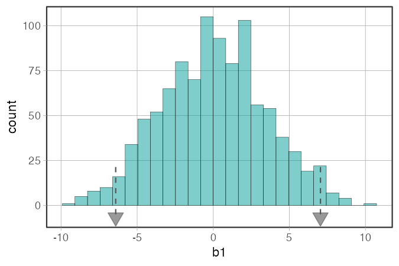
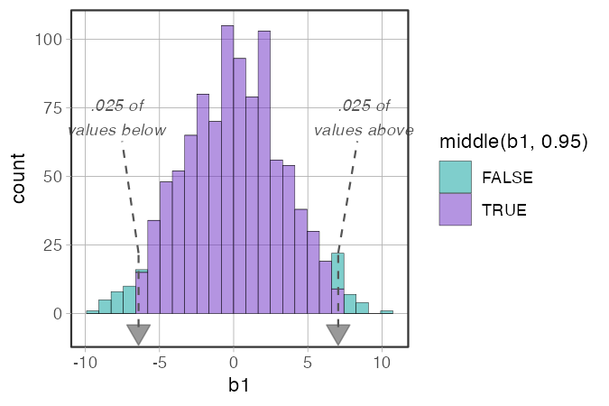
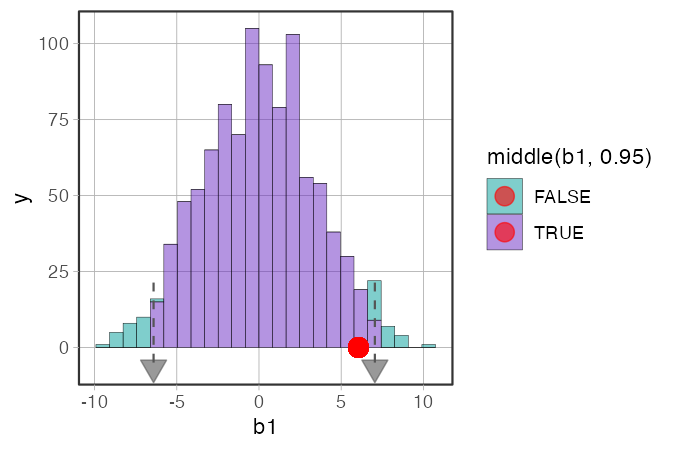
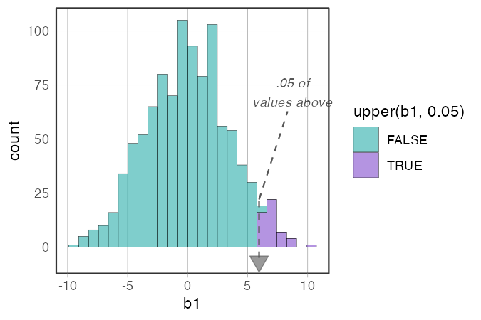
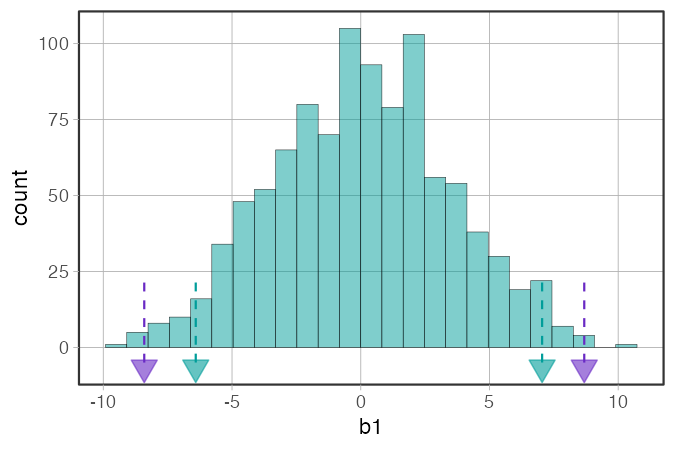

# `gf_cutoffs()` -- Mark Cutoffs on a Sampling Distribution

**Source:** [`gf_cutoffs.R`](../gf_cutoffs.R) -- beta function, load with `source()`.

```r
source("https://raw.githubusercontent.com/coursekata/beta-functions/refs/heads/main/gf_cutoffs.R")
```

---

## What it does

`gf_cutoffs()` adds dashed vertical lines and downward-pointing triangle markers at the empirical quantile cutoffs defined by a distribution-part function (`middle()`, `tails()`, `upper()`, `lower()`, or `outer()`).

It works in two modes:

- **Auto-detect** (same usage as `show_cutoffs()`): omit the expression and `gf_cutoffs()` reads the distribution-part function from the histogram's fill aesthetic.
- **Explicit**: pass the expression directly as an argument. The histogram needs no fill -- the expression alone drives the cutoffs.

The explicit mode also makes it easy to **stack multiple cutoff sets** on the same histogram with different colors, which `show_cutoffs()` cannot do.

---

## The distribution-part functions

`gf_cutoffs()` works with any of the five distribution-part functions. Each one classifies observations based on where they fall relative to a cutoff. See [`distribution_parts.md`](distribution_parts.md) for full documentation.

| Function | Marks... | Typical use |
|---|---|---|
| `middle(x, prop)` | the central `prop` of values | highlight the "likely" region; shade the two tails |
| `tails(x, prop)` | the outer `prop` of values (both tails combined) | highlight the "unlikely" region |
| `upper(x, prop)` | the top `prop` of values | one-tailed upper test |
| `lower(x, prop)` | the bottom `prop` of values | one-tailed lower test |
| `outer(x, prop)` | each tail gets `prop/2` of values | same as `tails()` with different framing |

---

## Usage

```r
source("gf_cutoffs.R")
library(coursekata)

set.seed(42)
sdob1 <- do(1000) * b1(shuffle(Tip) ~ Condition, data = TipExperiment)

# Auto-detect mode (fill drives the cutoffs)
gf_histogram(~ b1, data = sdob1, fill = ~ middle(b1, .95)) %>%
  gf_cutoffs()

# Explicit mode (no fill needed)
gf_histogram(~ b1, data = sdob1) %>%
  gf_cutoffs(middle(b1, .95))
```

---

## Examples

### Auto-detect mode

```r
gf_histogram(~ b1, data = sdob1, fill = ~ middle(b1, .95)) %>%
  gf_cutoffs()
```


*What to look for:* The colored regions show the most extreme 5% of shuffled b1 values. The dashed lines and triangle markers make the boundaries between the middle 95% and the tails explicit. This is the same usage pattern as `show_cutoffs()`.

---

### Explicit mode

```r
gf_histogram(~ b1, data = sdob1) %>%
  gf_cutoffs(middle(b1, .95))
```



*What to look for:* No fill is needed -- the expression passed to `gf_cutoffs()` drives both the cutoff positions and the label proportions. The histogram is uncolored, which can be cleaner when the focus is the cutoff lines rather than the colored regions.

---

### With labels

```r
gf_histogram(~ b1, data = sdob1, fill = ~ middle(b1, .95)) %>%
  gf_cutoffs(labels = TRUE)
```



*What to look for:* `labels = TRUE` adds text annotations showing the proportion of values beyond each cutoff. Labels always describe the tail region -- the smaller side of each boundary -- regardless of which distribution-part function was used.

---

### Overlaying the observed b1

```r
obs_b1 <- b1(Tip ~ Condition, data = TipExperiment)

gf_histogram(~ b1, data = sdob1, fill = ~ middle(b1, .95)) %>%
  gf_cutoffs() %>%
  gf_point(0 ~ obs_b1, color = "red", size = 4)
```



*What to look for:* The red dot is the b1 observed in the actual data. If it falls in the shaded tail region (beyond the cutoff markers), the result is statistically unlikely under the empty model. If it is inside the middle region, there is not enough evidence to reject the empty model.

---

### One-tailed: upper

```r
gf_histogram(~ b1, data = sdob1, fill = ~ upper(b1, .05)) %>%
  gf_cutoffs(labels = TRUE)
```



*What to look for:* Only the top 5% is shaded -- appropriate for a directional hypothesis (e.g., you predicted the treatment group would have *higher* tips). Only one cutoff marker appears.

---

### Stacking two alpha levels

```r
gf_histogram(~ b1, data = sdob1) %>%
  gf_cutoffs(middle(b1, .95), color = "#009d9a") %>%
  gf_cutoffs(middle(b1, .99), color = "#6929c4")
```



*What to look for:* Two sets of cutoff markers at different alpha levels, each in a distinct color. The teal markers show the 95% boundary; the purple markers show the 99% boundary. This is not possible with `show_cutoffs()` and is useful for comparing what changes when you tighten the alpha level.

---

## Arguments

| Argument | Default | Description |
|---|---|---|
| `p` | *(required)* | A ggplot histogram (from `gf_histogram()`). |
| `expr` | `NULL` | A bare distribution-part call, e.g. `middle(b1, .95)`. If omitted, the fill aesthetic is inspected for a distribution-part function. |
| `color` | `"#555555"` | Color of the marker triangles, dashed lines, and labels. |
| `size` | `4` | Size of the downward-pointing triangle markers. |
| `labels` | `FALSE` | If `TRUE`, adds text annotations showing the tail proportion at each cutoff. |

---

## Teaching tips

- For the standard sampling distribution workflow, `gf_cutoffs()` is a drop-in replacement for `show_cutoffs()`. The auto-detect mode (`fill = ~middle(...)` then `%>% gf_cutoffs()`) is identical in usage.
- The explicit mode (`gf_cutoffs(middle(b1, .95))`) can be introduced after students are comfortable with the fill-based workflow. It makes the connection between the distribution-part functions and the cutoff markers more visible.
- Use `labels = TRUE` in classroom presentations where you want students to read off the tail proportion without doing mental math.
- The stacking capability is useful for showing how the cutoff boundaries shift when you change the alpha level. Teal for .95 and purple for .99 uses the CourseKata palette.
- The `middle()` and `tails()` functions are complementary framings of the same idea: `middle(b1, .95)` colors what is *likely*; `tails(b1, .05)` colors what is *unlikely*. Showing students both framings with `gf_cutoffs()` reinforces that they describe the same boundaries.

---

## How it fits with the other functions

`gf_cutoffs()` sits at the end of the sampling distribution workflow:

```r
# 1. Build the sampling distribution
sdob1 <- do(1000) * b1(shuffle(Tip) ~ Condition, data = TipExperiment)

# 2. Visualize it (with or without colored regions)
gf_histogram(~ b1, data = sdob1, fill = ~ middle(b1, .95)) %>%

# 3. Mark the cutoffs explicitly
  gf_cutoffs(labels = TRUE) %>%

# 4. Overlay the observed statistic
  gf_point(0 ~ obs_b1, color = "red", size = 4)
```

See also:

- [`show_cutoffs.md`](show_cutoffs.md) -- the graduated predecessor; `gf_cutoffs()` is intended as its replacement
- [`distribution_parts.md`](distribution_parts.md) -- full documentation of `middle()`, `tails()`, `upper()`, `lower()`, `outer()`
- [`gf_squareplot.md`](gf_squareplot.md) -- countable histogram used earlier in the sampling distribution sequence
- [`gf_shuffle_grid.md`](gf_shuffle_grid.md) -- "spot the real data" display used to introduce the logic of randomization
