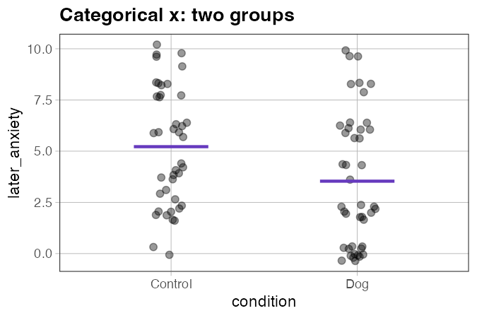
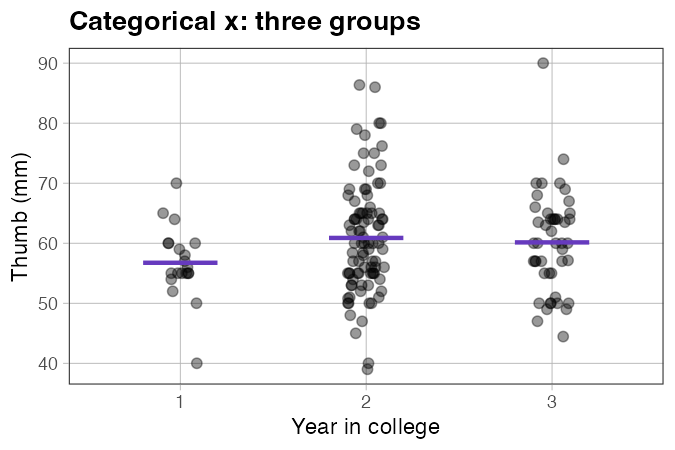
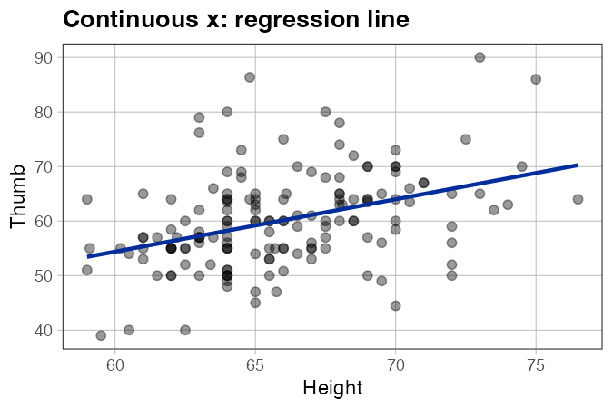
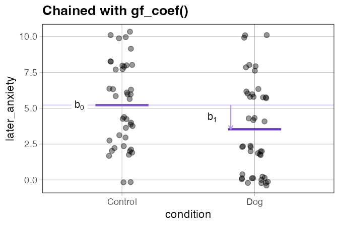
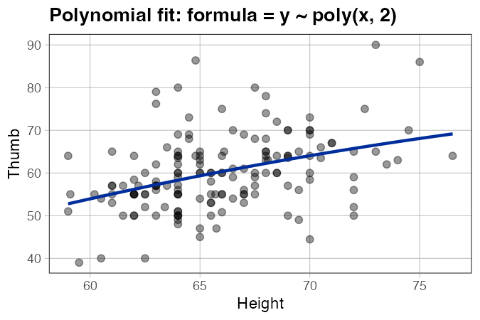

# `gf_lm()` — Overlay a linear model for categorical or continuous x

**Source:** [`gf_lm.R`](../gf_lm.R)

---

## What it does

`gf_lm()` extends ggformula's built-in `gf_lm()` to handle both categorical and continuous x variables — mirroring what `lm()` itself already does:

```r
lm(later_anxiety ~ condition, data = er)   # categorical x — works
lm(Thumb ~ Height,            data = Fingers)   # continuous x — works
```

For **categorical x**, it draws a horizontal segment at the group mean for each level — exactly what `lm(y ~ group)` fits. For **continuous x**, it draws a regression line, identical to the original `gf_lm()`.

The result is a single function that works the same way regardless of x type:

```r
gf_jitter(later_anxiety ~ condition, data = er)  %>% gf_lm()   # categorical
gf_point(Thumb ~ Height,            data = Fingers) %>% gf_lm()   # continuous
```

`gf_lm()` reads the mappings directly off the plot, so it works transparently with in-formula expressions including `shuffle()`. The model overlay always reflects the same data that was plotted — not an independent re-evaluation.

---

## Usage

```r
# Source the file (not yet in the coursekata package)
source("https://raw.githubusercontent.com/coursekata/beta-functions/refs/heads/main/gf_lm.R")

# Categorical x
gf_jitter(later_anxiety ~ condition, data = er, width = 0.1) %>%
  gf_lm()

# Continuous x
gf_point(Thumb ~ Height, data = Fingers) %>%
  gf_lm()

# Chain with gf_coef() to label b0 and b1
gf_jitter(later_anxiety ~ condition, data = er, width = 0.1) %>%
  gf_lm() %>%
  gf_coef()
```

---

## Examples

### Categorical x: two groups

```r
library(coursekata)
source("gf_lm.R")

gf_jitter(later_anxiety ~ condition, data = er, width = 0.1, alpha = 0.4) %>%
  gf_lm()
```



*What to look for:* Each segment sits at the group mean. The gap between the two segments is b1 — the difference in means between the treatment and control groups.

---

### Categorical x: three groups

```r
Fingers3 <- droplevels(subset(Fingers, Year %in% c("1", "2", "3")))

gf_jitter(Thumb ~ Year, data = Fingers3, width = 0.1, alpha = 0.4) %>%
  gf_lm()
```



*What to look for:* One segment per group, each at its own mean. The reference group (year 1) sits at b0; the other segments sit at b0 + b1 and b0 + b2.

---

### Continuous x

```r
gf_point(Thumb ~ Height, data = Fingers, alpha = 0.4) %>%
  gf_lm()
```



*What to look for:* A regression line through the data. The slope reflects b1 — how much Thumb length increases for each additional unit of Height.

---

### Chained with `gf_coef()`

```r
gf_jitter(later_anxiety ~ condition, data = er, width = 0.1, alpha = 0.4) %>%
  gf_lm() %>%
  gf_coef()
```



*What to look for:* `gf_lm()` draws the segments; `gf_coef()` adds the b0 reference line and a labeled arrow showing the size of b1. Together they give students a complete picture of the fitted model.

---

### Shuffled data

```r
set.seed(7)
gf_jitter(shuffle(later_anxiety) ~ condition, data = er, width = 0.1, alpha = 0.4) %>%
  gf_lm()
```


*What to look for:* The segments move with each shuffle — reflecting a model fit to the permuted data, not the original. Run this several times alongside the real-data version so students can see how much the group means vary under the null.

---

### Polynomial fit

```r
gf_point(Thumb ~ Height, data = Fingers, alpha = 0.4) %>%
  gf_lm(formula = y ~ poly(x, 2))
```



*What to look for:* The curve fits the data more flexibly than a straight line. The `formula` argument passes directly to `StatLm`, so any model formula that works in `lm()` works here.

---

## Arguments

| Argument | Default | Description |
|---|---|---|
| `object` | *(required)* | An existing ggformula or ggplot2 plot, or a formula for standalone use. |
| `width` | `0.4` | *(Categorical x)* Total width of each group segment in x-axis units. |
| `color` | `"#663abe"` | *(Categorical x)* Segment color. |
| `linewidth` | `1` | *(Categorical x)* Segment line width. |
| `formula` | `y ~ x` | *(Continuous x)* Model formula passed to `StatLm`. Use `y ~ poly(x, 2)` for polynomial fits. |
| `interval` | `"none"` | *(Continuous x)* Confidence or prediction interval: `"none"`, `"confidence"`, or `"prediction"`. |
| `...` | | *(Categorical x)* Additional arguments passed to `geom_segment()`. *(Continuous x)* Additional arguments passed to `ggformula::gf_lm()`. |

---

## How it fits with the other functions

```r
gf_jitter(...)    # plot the data
  %>% gf_lm()    # overlay the model (segments for categorical, line for continuous)
  %>% gf_coef()  # label b0 and b1
```

For `gf_shuffle_grid()`, `gf_lm()` is used internally on each panel when `show_model = TRUE`.

See also:

- [`gf_coef.md`](gf_coef.md) — labels b0, b1, b2, … on the plot
- [`gf_lm_cat.md`](gf_lm_cat.md) — categorical-only version (explicit, no dispatch)
- [`gf_shuffle_grid.md`](gf_shuffle_grid.md) — builds a grid of shuffled plots for randomization intuition
