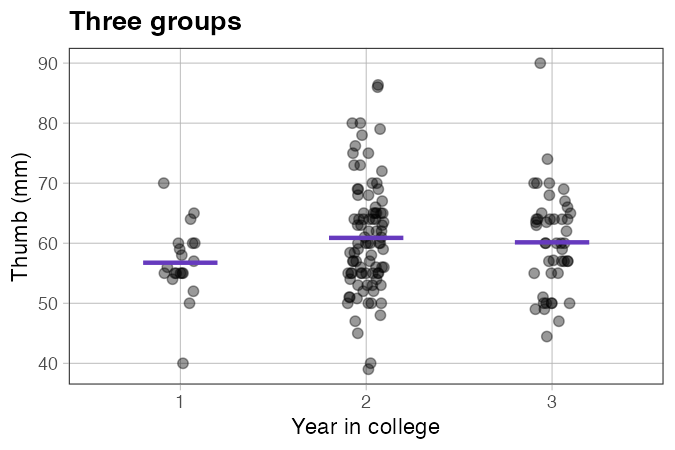
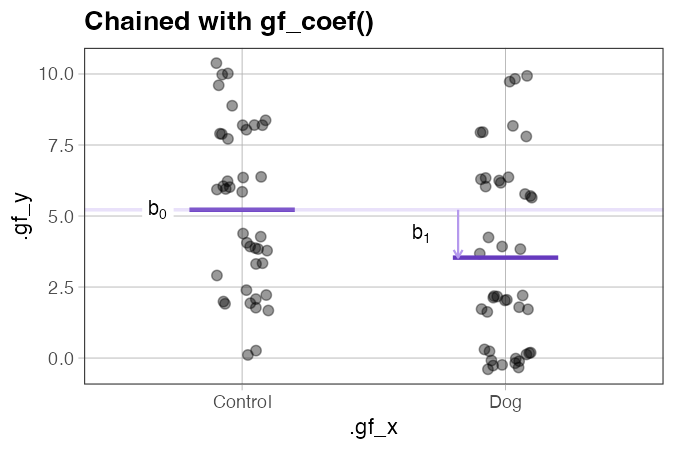
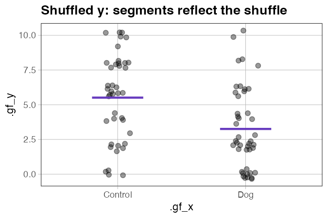
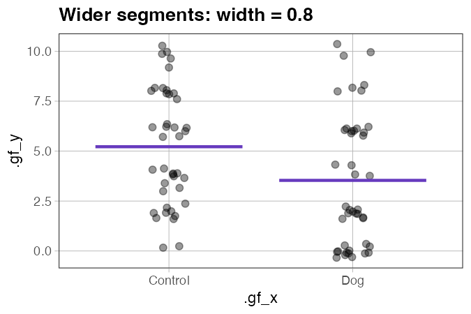
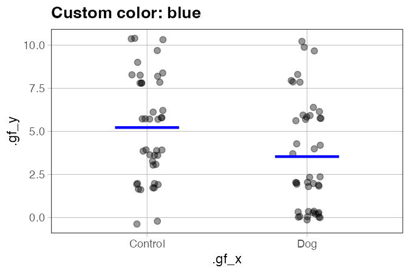

# `gf_lm_cat()` — Overlay group means for categorical x models

**Source:** [`gf_lm_cat.R`](../gf_lm_cat.R)

---

## What it does

`gf_lm_cat()` works like `gf_lm()` but for categorical x variables. Instead of a regression line, it draws a horizontal segment at the group mean for each level of x — which is exactly what `lm(y ~ group)` fits.

The pedagogical goal is to make the fitted model visible on the same plot as the data, using the same pipe idiom regardless of whether x is categorical or continuous:

```r
gf_jitter(y ~ group, data = d) %>% gf_lm_cat()   # categorical
gf_point(y ~ x,     data = d) %>% gf_lm()        # continuous
```

`gf_lm_cat()` reads the y and x mappings directly off the plot, so it works transparently with in-formula expressions including `shuffle()`. The segments always reflect the same data that was plotted — not an independent re-evaluation.

---

## Usage

```r
# Source the file (not yet in the coursekata package)
source("https://raw.githubusercontent.com/coursekata/beta-functions/refs/heads/main/gf_lm_cat.R")

# Basic use — pipe onto any gf_jitter() or gf_point() with categorical x
gf_jitter(later_anxiety ~ condition, data = er, width = 0.1) %>%
  gf_lm_cat()

# Chain with gf_coef() to also label b0 and b1
gf_jitter(later_anxiety ~ condition, data = er, width = 0.1) %>%
  gf_lm_cat() %>%
  gf_coef()
```

---

## Examples

### Two groups

```r
library(coursekata)
source("gf_lm_cat.R")

gf_jitter(later_anxiety ~ condition, data = er, width = 0.1, alpha = 0.4) %>%
  gf_lm_cat()
```


*What to look for:* Each segment sits at the group mean. The gap between the two segments is b1 — the difference in means between the treatment and control groups.

---

### Three groups

```r
Fingers3 <- droplevels(subset(Fingers, Year %in% c("1", "2", "3")))

gf_jitter(Thumb ~ Year, data = Fingers3, width = 0.1, alpha = 0.4) %>%
  gf_lm_cat()
```



*What to look for:* One segment per group, each at its own mean. The reference group (year 1) sits at b0; the other segments sit at b0 + b1 and b0 + b2.

---

### Chained with `gf_coef()`

```r
gf_jitter(later_anxiety ~ condition, data = er, width = 0.1, alpha = 0.4) %>%
  gf_lm_cat() %>%
  gf_coef()
```



*What to look for:* `gf_lm_cat()` draws the segments; `gf_coef()` adds the b0 horizontal reference line and a labeled arrow showing the size of b1. Together they give students a complete picture of the fitted model.

---

### Shuffled data

```r
gf_jitter(shuffle(later_anxiety) ~ condition, data = er, width = 0.1, alpha = 0.4) %>%
  gf_lm_cat()
```



*What to look for:* The segments move with each shuffle — reflecting a model fit to the permuted data, not the original. Run this several times alongside the real-data version so students can see how much the group means vary under the null.

---

### Wider segments

```r
gf_jitter(later_anxiety ~ condition, data = er, width = 0.1, alpha = 0.4) %>%
  gf_lm_cat(width = 0.8)
```



*What to look for:* `width` controls how much of the horizontal space each segment spans. Wider segments (up to 1.0) make the means more prominent; narrower segments keep more visual focus on the data points.

---

### Custom color

```r
gf_jitter(later_anxiety ~ condition, data = er, width = 0.1, alpha = 0.4) %>%
  gf_lm_cat(color = "blue")
```



*Note:* When chaining with `gf_coef()`, pass the same `color` to both so the model overlay is visually consistent.

---

## Arguments

| Argument | Default | Description |
|---|---|---|
| `p` | *(required)* | An existing ggformula or ggplot2 plot with a categorical x variable. |
| `width` | `0.4` | Total width of each group segment in x-axis units. |
| `color` | `"#663abe"` | Segment color. |
| `linewidth` | `1` | Segment line width. |
| `...` | | Additional arguments passed to `geom_segment()` (e.g., `linetype`, `alpha`). |

---

## How it fits with the other functions

```r
gf_jitter(...)       # plot the data
  %>% gf_lm_cat()   # overlay group means
  %>% gf_coef()     # label b0 and b1
```

See also:

- [`gf_coef.md`](gf_coef.md) — labels b0, b1, b2, … on the plot
- [`gf_shuffle_grid.md`](gf_shuffle_grid.md) — builds a grid of shuffled plots for randomization intuition
