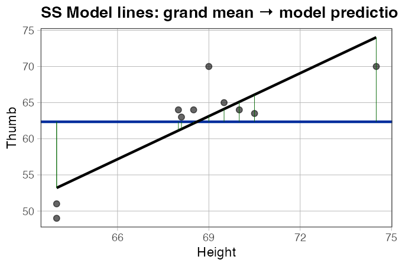
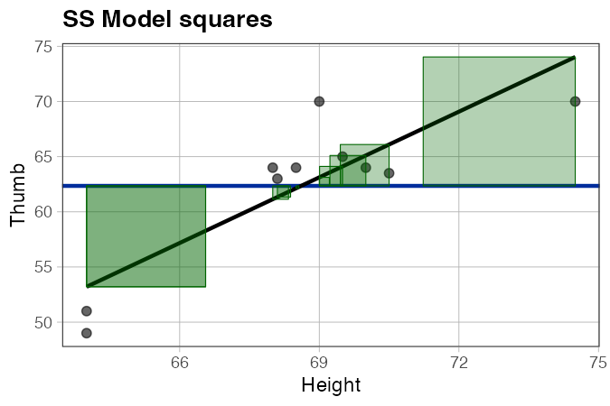
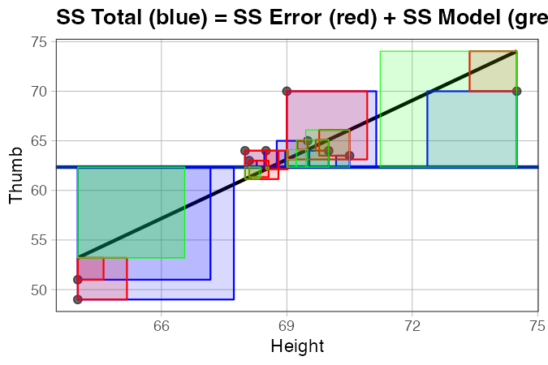
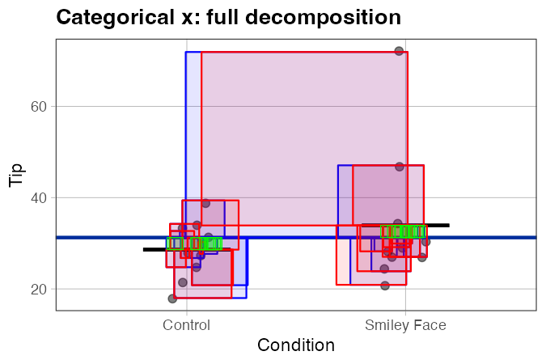

# `gf_reduce()` and `gf_square_reduce()` — Visualize SS Model

**Source:** [`gf_reduce.R`](../gf_reduce.R)

---

## What it does

`gf_reduce()` and `gf_square_reduce()` visualize the reduction in error achieved by adding a predictor — the piece of variation that the model *explains*. Together with `gf_resid()` and `gf_square_resid()`, they let students see the full SS decomposition on a single plot:

| Function | What it draws | SS component |
|---|---|---|
| `gf_square_resid(empty_model)` | obs → grand mean | SS Total |
| `gf_square_resid(complex_model)` | obs → model predictions | SS Error |
| `gf_square_reduce(complex_model)` | grand mean → model predictions | SS Model |

**SS Total = SS Model + SS Error** — and that relationship is visible in the squares.

The connection to PRE: the squares drawn by `gf_square_reduce()` are the numerator of PRE; the squares drawn by `gf_square_resid(empty_model)` are the denominator.

> **Best with small datasets.** With many points the squares overlap and become hard to read. Use a small sample (8–15 points) when the goal is to make the decomposition visible.

---

## Usage

```r
# Source the file (not yet in the coursekata package)
source("https://raw.githubusercontent.com/coursekata/beta-functions/refs/heads/main/gf_reduce.R")

m_empty   <- lm(Thumb ~ NULL,   data = d)
m_complex <- lm(Thumb ~ Height, data = d)

# Lines: grand mean → model predictions
gf_point(Thumb ~ Height, data = d) %>%
  gf_model(m_complex) %>%
  gf_reduce(m_complex)

# Squares: same distances as squares
gf_point(Thumb ~ Height, data = d) %>%
  gf_model(m_complex) %>%
  gf_square_reduce(m_complex)
```

---

## Examples

### SS Model lines

```r
library(coursekata)
source("gf_reduce.R")

set.seed(1)
d <- Fingers[sample(nrow(Fingers), 10), ]
m_empty   <- lm(Thumb ~ NULL,   data = d)
m_complex <- lm(Thumb ~ Height, data = d)

gf_point(Thumb ~ Height, data = d) %>%
  gf_model(m_empty) %>%
  gf_model(m_complex) %>%
  gf_reduce(m_complex, color = "darkgreen")
```



*What to look for:* Each vertical line runs from the grand mean (horizontal line) to the regression line. Taller lines mean the predictor is doing more work for that observation. Points far from the mean of x get the longest lines.

---

### SS Model squares

```r
gf_point(Thumb ~ Height, data = d) %>%
  gf_model(m_empty) %>%
  gf_model(m_complex) %>%
  gf_square_reduce(m_complex, fill = "darkgreen", color = "darkgreen", alpha = 0.3)
```



*What to look for:* Each square's area represents how much that observation contributes to SS Model. The total area of all green squares equals SS Model.

---

### Full SS decomposition

```r
gf_point(Thumb ~ Height, data = d) %>%
  gf_model(m_empty) %>%
  gf_model(m_complex) %>%
  gf_square_resid(m_empty,    fill = "blue",  color = "blue",  alpha = 0.15) %>%
  gf_square_resid(m_complex,  fill = "red",   color = "red",   alpha = 0.15) %>%
  gf_square_reduce(m_complex, fill = "green", color = "green", alpha = 0.15)
```



*What to look for:* The blue squares (SS Total) are the sum of the red (SS Error) and green (SS Model) squares. When the green squares are large relative to the blue, PRE is high — the predictor explains a lot. When they are small, PRE is low.

---

### Categorical x

```r
set.seed(1)
tip_small <- TipExperiment[sample(nrow(TipExperiment), 20), ]
m_cat_empty   <- lm(Tip ~ NULL,      data = tip_small)
m_cat_complex <- lm(Tip ~ Condition, data = tip_small)

gf_jitter(Tip ~ Condition, data = tip_small, width = 0.1, alpha = 0.5) %>%
  gf_model(m_cat_empty) %>%
  gf_model(m_cat_complex) %>%
  gf_square_resid(m_cat_empty,    fill = "blue",  color = "blue",  alpha = 0.1) %>%
  gf_square_resid(m_cat_complex,  fill = "red",   color = "red",   alpha = 0.1) %>%
  gf_square_reduce(m_cat_complex, fill = "green", color = "green", alpha = 0.1)
```



*What to look for:* Every point in the same group gets the same-length green line — because the complex model predicts the group mean for all members. The green squares represent how far each group mean sits from the grand mean. When the groups have very different means, the green squares are large.

---

## Arguments

### `gf_reduce()`

| Argument | Default | Description |
|---|---|---|
| `plot` | *(required)* | An existing ggformula or ggplot2 plot. |
| `model` | *(required)* | A fitted `lm()` object (the complex model). The empty model is derived automatically as the grand mean. |
| `linewidth` | `0.2` | Width of the SS Model lines. |
| `...` | | Additional arguments passed to `geom_segment()` (e.g., `color`, `alpha`). |

### `gf_square_reduce()`

| Argument | Default | Description |
|---|---|---|
| `plot` | *(required)* | An existing ggformula or ggplot2 plot. |
| `model` | *(required)* | A fitted `lm()` object (the complex model). |
| `aspect` | `4/6` | Aspect ratio correction for proper square scaling relative to the plot dimensions. |
| `alpha` | `0.1` | Fill transparency. |
| `...` | | Additional arguments passed to `geom_polygon()` (e.g., `color`, `fill`). |

---

## Known behavior notes

- **Small datasets only.** With large n, squares overlap heavily. Sample down to 8–15 points for classroom use.
- **Mapped fill aesthetics (e.g., `fill = ~Sex`) are not supported.** The squares are drawn from an internal data frame that doesn't carry the original variables. Use fixed colors (e.g., `fill = "green"`) instead.
- **The empty model is always the grand mean.** There is no argument for a custom empty model — `gf_square_reduce()` always compares the complex model to `lm(y ~ NULL)`.

---

## How it fits with the other functions

```r
gf_point(y ~ x, data = d) %>%
  gf_model(empty_model)    %>%    # horizontal grand mean line
  gf_model(complex_model)  %>%    # regression line
  gf_square_resid(empty_model,   fill = "blue")  %>%   # SS Total
  gf_square_resid(complex_model, fill = "red")   %>%   # SS Error
  gf_square_reduce(complex_model, fill = "green")      # SS Model
```

See also:

- [`gf_coef.md`](gf_coef.md) — labels b0, b1, b2 … on the plot
- [`gf_lm.md`](gf_lm.md) — overlays the fitted model for categorical or continuous x
