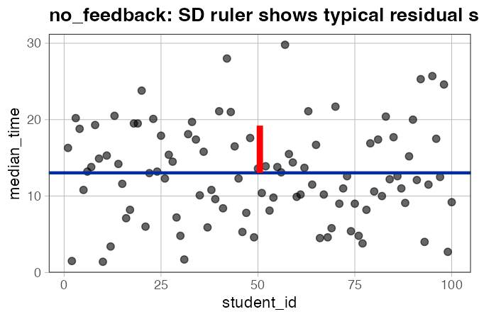
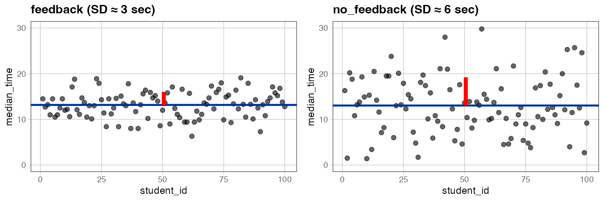
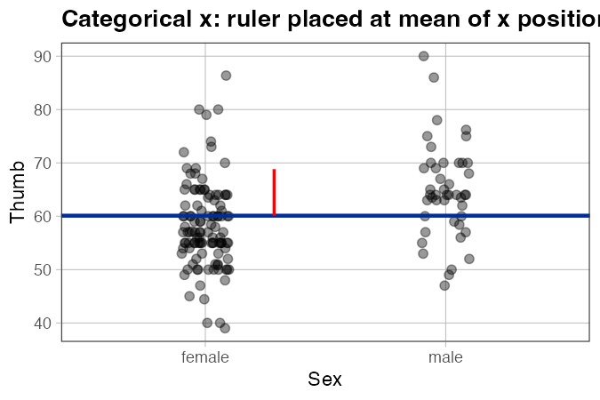
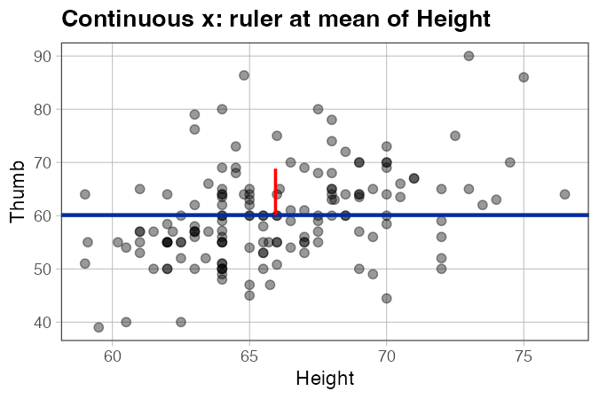
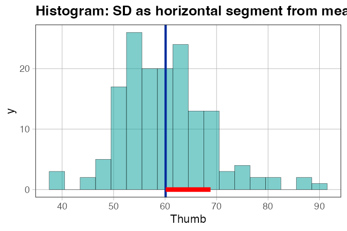
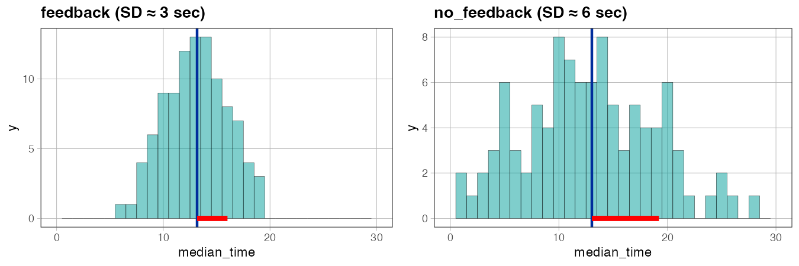

# `gf_sd_ruler()` — Visualize Standard Deviation on a Plot

**Source:** [`library(coursekata)`](https://github.com/coursekata/coursekata-r) for the base version. Extended prototype with histogram support: [`gf_sd_ruler.R`](../gf_sd_ruler.R) (source this to override).

---

## What it does

`gf_sd_ruler()` adds a segment representing one standard deviation, anchored at the mean. The orientation depends on where the outcome variable lives:

- **Scatter or jitter plot** (outcome on y-axis) → **vertical** segment, running from the mean up to mean + SD, placed at a chosen x position.
- **Histogram** (outcome on x-axis) → **horizontal** segment, running from the mean to mean + SD along the baseline.

The function auto-detects which case applies from the plot's axis mappings, so the same call works for both plot types.

The core teaching use: students can *see* that SD is just a residual of typical size — the segment looks exactly like a residual drawn from the empty model prediction. This makes the abstract formula $s = \sqrt{\frac{\sum(Y_i - \bar{Y})^2}{n-1}}$ concrete.

---

## Usage

```r
library(coursekata)

# Scatter / jitter plot (y-axis outcome) — in coursekata package
gf_point(median_time ~ student_id, data = no_feedback_data) %>%
  gf_model(lm(median_time ~ NULL, data = no_feedback_data)) %>%
  gf_sd_ruler()

# Histogram (x-axis outcome) — requires extended prototype
source("gf_sd_ruler.R")

gf_histogram(~ Thumb, data = Fingers) %>%
  gf_model(lm(Thumb ~ NULL, data = Fingers)) %>%
  gf_sd_ruler()
```

---

## Examples

### Basic SD ruler

```r
library(coursekata)

# Simulate two groups with different spreads
set.seed(141); feedback_data    <- data.frame(student_id = 1:100, median_time = round(rnorm(100, 13, 3), 1))
set.seed(154); no_feedback_data <- data.frame(student_id = 1:100, median_time = round(rnorm(100, 13, 6), 1))

no_feedback_empty <- lm(median_time ~ NULL, data = no_feedback_data)

gf_point(median_time ~ student_id, data = no_feedback_data) %>%
  gf_model(no_feedback_empty) %>%
  gf_sd_ruler(color = "red", size = 2)
```



*What to look for:* The red segment runs from the mean (the horizontal model line) up by one standard deviation. It looks just like a residual — because it is. A typical residual from the empty model is about one SD tall.

---

### Comparing two distributions

```r
feedback_empty    <- lm(median_time ~ NULL, data = feedback_data)
no_feedback_empty <- lm(median_time ~ NULL, data = no_feedback_data)

p_feedback <- gf_point(median_time ~ student_id, data = feedback_data) %>%
  gf_lims(y = c(0, 30)) %>%
  gf_labs(title = "feedback (SD ≈ 3 sec)") %>%
  gf_model(feedback_empty) %>%
  gf_sd_ruler(color = "red", size = 2)

p_no_feedback <- gf_point(median_time ~ student_id, data = no_feedback_data) %>%
  gf_lims(y = c(0, 30)) %>%
  gf_labs(title = "no_feedback (SD ≈ 6 sec)") %>%
  gf_model(no_feedback_empty) %>%
  gf_sd_ruler(color = "red", size = 2)

gridExtra::grid.arrange(p_feedback, p_no_feedback, ncol = 2)
```



*What to look for:* Both groups aim for 13 seconds and both have the same mean, but the SD rulers are very different lengths. The `no_feedback` ruler is twice as tall — the model is equally wrong on average, but the typical size of that error is much larger.

---

### Categorical x (jitter plot)

```r
gf_jitter(Thumb ~ Sex, data = Fingers, width = 0.1, alpha = 0.4) %>%
  gf_model(lm(Thumb ~ NULL, data = Fingers)) %>%
  gf_sd_ruler(where = "mean")
```



*What to look for:* Works the same way for categorical x. The ruler is placed at the mean of the numeric x positions (midpoint between the two groups). Use `where = "middle"` or `where = "median"` to adjust placement.

---

### Placed at a specific x position

```r
gf_point(Thumb ~ Height, data = Fingers, alpha = 0.4) %>%
  gf_model(lm(Thumb ~ NULL, data = Fingers)) %>%
  gf_sd_ruler(where = "mean")
```



*What to look for:* With continuous x, `where = "mean"` places the ruler at the mean of Height — roughly the center of the data cloud. This makes it easy to see the ruler without it overlapping the edges of the plot.

---

### Histogram (extended prototype)

> Source `gf_sd_ruler.R` to get histogram support — the coursekata-r version does not yet include this.

```r
source("gf_sd_ruler.R")  # extended version

gf_histogram(~ Thumb, data = Fingers) %>%
  gf_model(lm(Thumb ~ NULL, data = Fingers)) %>%
  gf_sd_ruler(color = "red", size = 2)
```



*What to look for:* `gf_model()` adds a vertical line at the mean. `gf_sd_ruler()` auto-detects that the outcome is on the x-axis and draws a **horizontal** segment running from the mean to mean + SD along the baseline. Students can see how wide one standard deviation is in the same units as the histogram bins.

---

### Histogram: comparing two distributions

```r
source("gf_sd_ruler.R")

p_feedback <- gf_histogram(~ median_time, data = feedback_data, binwidth = 1) %>%
  gf_lims(x = c(0, 30)) %>%
  gf_labs(title = "feedback") %>%
  gf_model(feedback_empty) %>%
  gf_sd_ruler(color = "red", size = 2)

p_no_feedback <- gf_histogram(~ median_time, data = no_feedback_data, binwidth = 1) %>%
  gf_lims(x = c(0, 30)) %>%
  gf_labs(title = "no_feedback") %>%
  gf_model(no_feedback_empty) %>%
  gf_sd_ruler(color = "red", size = 2)

gridExtra::grid.arrange(p_feedback, p_no_feedback, ncol = 2)
```



*What to look for:* Both distributions are centered near 13 seconds, but the red SD segments have very different lengths — the no-feedback group has a much wider spread. Fixing the x-axis with `gf_lims()` makes the comparison honest.

---

## Arguments

| Argument | Default | Description |
|---|---|---|
| `p` | *(required)* | A ggplot object, typically from `gf_point()` or `gf_jitter()`. |
| `y` | inferred | The y-variable (bare name or string). Defaults to the plot's mapped y. |
| `data` | `p$data` | Dataset. Defaults to the plot's data. |
| `x` | inferred | The x-variable used for placement. Defaults to the plot's mapped x. |
| `where` | `"middle"` | Where to place the ruler on the x-axis: `"middle"` (midpoint of x range), `"mean"`, or `"median"`. |
| `color` | `"red"` | Segment color. |
| `size` | `0.8` | Line width of the segment. |
| `...` | | Additional arguments passed to `geom_segment()`. |

---

## Teaching tips

- Introduce `gf_sd_ruler()` immediately after students fit an empty model with `gf_model()`. The ruler looks like a residual — that's the point. SD is the size of a *typical* residual.
- Use `gf_lims(y = c(...))` to fix the y-axis when placing the two-distribution comparison side by side. Without it, R will auto-scale each plot, making the spreads look the same.
- The segment goes from the mean *up* by one SD. Remind students that SD is always positive — the direction of the segment doesn't mean "above average is worse."
- `size` controls line thickness; `size = 2` makes the ruler easier to see in a projected classroom setting.

---

## How it fits with the other functions

`gf_sd_ruler()` is typically used right after `gf_model()` with an empty model:

```r
gf_point(y ~ x, data = d) %>%
  gf_model(lm(y ~ NULL, data = d)) %>%
  gf_sd_ruler()
```

See also:

- [`gf_coef.md`](gf_coef.md) — labels b0 and b1 on a regression plot
- [`gf_squareplot.md`](gf_squareplot.md) — countable histogram, used alongside SD for sampling distributions
