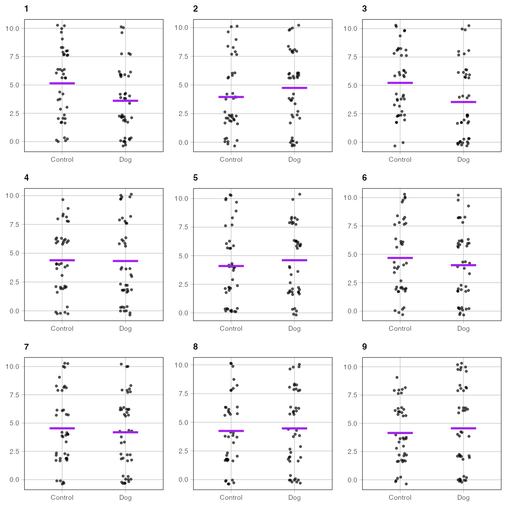
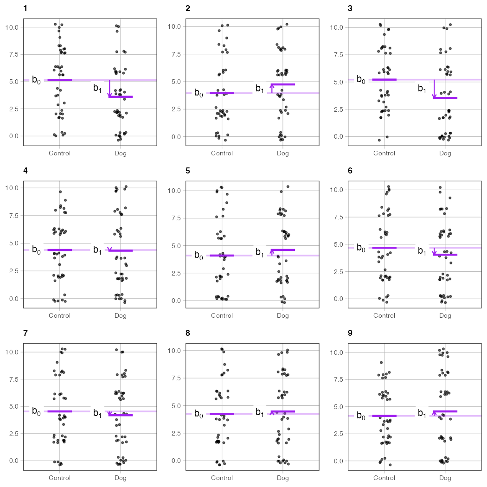
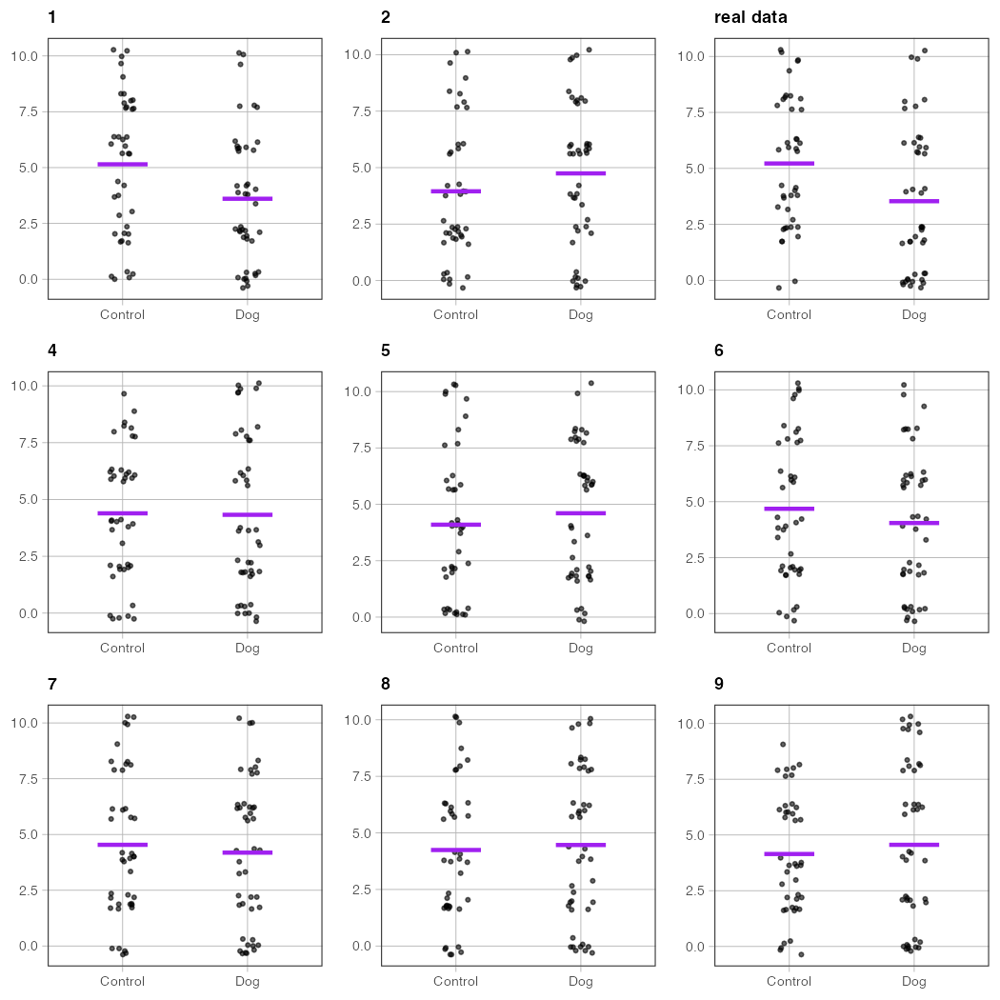
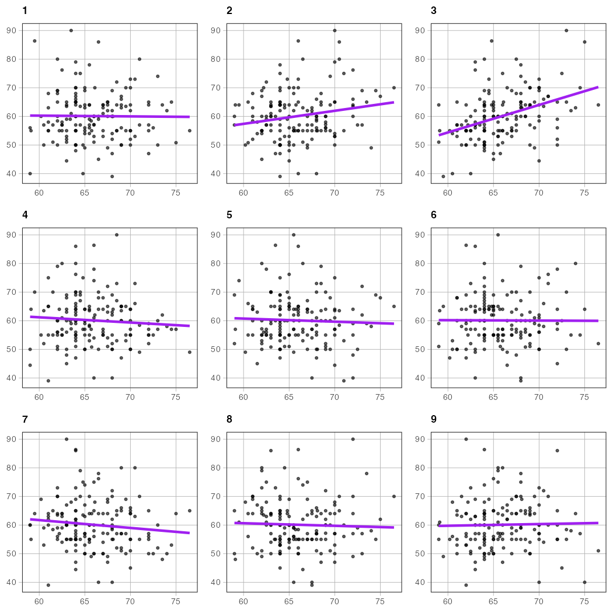
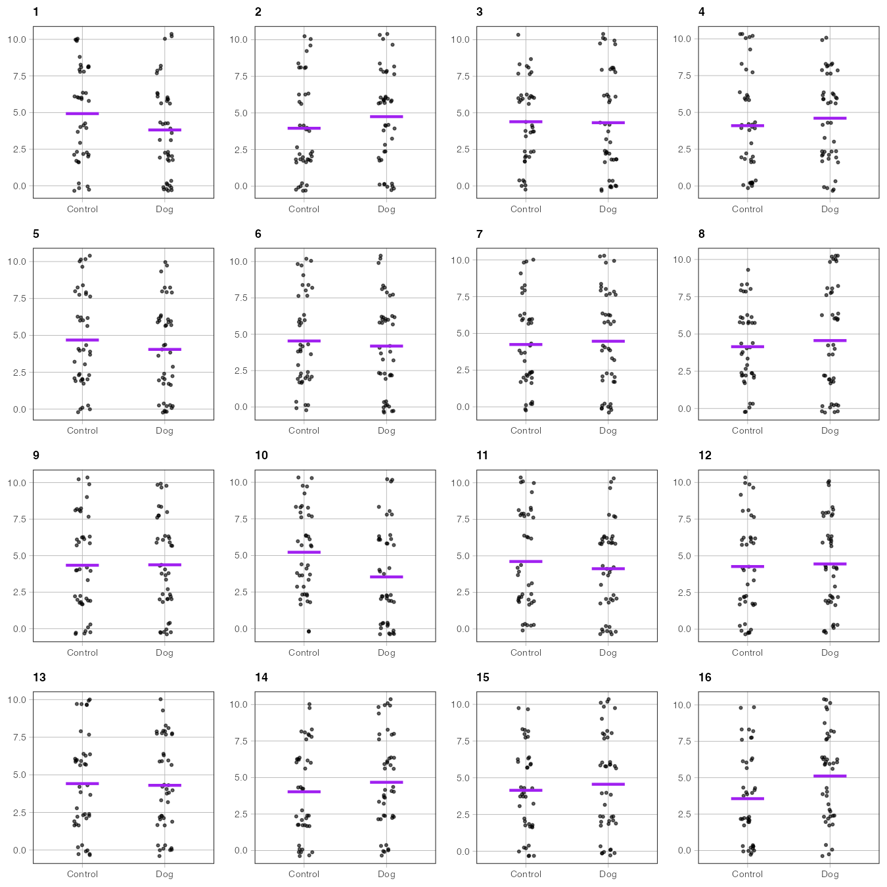

# `gf_shuffle_grid()` — Spot the real data: a randomization grid

**Source:** [`gf_shuffle_grid.R`](../gf_shuffle_grid.R)

---

## What it does

`gf_shuffle_grid()` builds a grid of small plots where one panel shows the real data and the rest show the same y variable randomly shuffled against x. Students are asked: *which panel is the real data?*

The exercise builds intuition for randomization and permutation tests. If the real relationship is strong, one panel will stand out clearly. If the real effect is weak, the real panel will be hard to distinguish from the shuffles — which is exactly the point.

Works for both **categorical x** (draws group-mean segments via `gf_lm_cat()`) and **continuous x** (draws a regression line via `gf_lm()`). The model overlay and coefficient annotations are optional.

---

## Usage

```r
# Source the file (not yet in the coursekata package)
source("https://raw.githubusercontent.com/coursekata/beta-functions/refs/heads/main/gf_shuffle_grid.R")

# Categorical x — the classic "spot the real data" exercise
gf_shuffle_grid(later_anxiety ~ condition, data = er)

# Continuous x
gf_shuffle_grid(Thumb ~ Height, data = Fingers, plot = "point")

# Reveal which panel is real (for worked examples)
gf_shuffle_grid(later_anxiety ~ condition, data = er, reveal = TRUE)
```

---

## Examples

### Categorical x: default 3×3 grid

```r
library(coursekata)
source("gf_shuffle_grid.R")

set.seed(7)
gf_shuffle_grid(later_anxiety ~ condition, data = er)
```



*What to look for:* The real panel has group means that look more separated than the shuffled panels. Students should scan all nine and vote before you reveal the answer.

---

### Categorical x: with model overlay

```r
set.seed(7)
gf_shuffle_grid(later_anxiety ~ condition, data = er, show_model = TRUE)
```


*What to look for:* The group-mean segments make the comparison easier to read. In the real panel the segments are farther apart; in the shuffled panels they hover close together near the grand mean.

---

### Categorical x: with coefficient annotations

```r
set.seed(7)
gf_shuffle_grid(later_anxiety ~ condition, data = er,
                show_model = TRUE, show_coef = TRUE)
```



*What to look for:* The b1 arrows make the size of the group difference explicit in every panel. In the shuffled panels the arrows are short and erratic; in the real panel the arrow is consistently longer.

---

### Categorical x: revealing the answer

```r
set.seed(7)
gf_shuffle_grid(later_anxiety ~ condition, data = er,
                show_model = TRUE, reveal = TRUE)
```



*When to use:* After students have made their guesses, re-run with `reveal = TRUE` to label the real-data panel. Useful for classroom debrief.

---

### Continuous x

```r
set.seed(7)
gf_shuffle_grid(Thumb ~ Height, data = Fingers, plot = "point")
```


*What to look for:* The real panel has a visible upward trend; the shuffled panels look like flat clouds of points. With a strong predictor like height, the real panel is usually easy to spot.

---

### Continuous x: with model overlay

```r
set.seed(7)
gf_shuffle_grid(Thumb ~ Height, data = Fingers,
                plot = "point", show_model = TRUE)
```



*What to look for:* The regression lines make the slope differences stark. The real panel has a clearly non-horizontal line; the shuffled panels have nearly flat lines with no consistent direction.

---

### Larger grid (4×4)

```r
set.seed(7)
gf_shuffle_grid(later_anxiety ~ condition, data = er, nrow = 4, ncol = 4)
```



*When to use:* More panels means more shuffles to compare against, making it harder to spot the real data by chance. Use a larger grid when the effect is strong and the 3×3 version feels too easy.

---

## Arguments

| Argument | Default | Description |
|---|---|---|
| `formula` | *(required)* | A formula `y ~ x` with one variable on each side. |
| `data` | *(required)* | A data frame. |
| `plot` | `"jitter"` | `"jitter"` or `"point"`. Use `"point"` for continuous x. |
| `nrow` | `3` | Number of rows in the grid. |
| `ncol` | `3` | Number of columns in the grid. Maximum 25 panels total. |
| `real_data` | `NULL` | Which panel (1-indexed, row-major) shows the real data. Defaults to a random position each call so the answer changes. Pass a fixed value for worked examples. |
| `show_model` | `TRUE` | Whether to overlay group-mean segments (`gf_lm_cat()`) or a regression line (`gf_lm()`). |
| `show_coef` | `FALSE` | Whether to add `gf_coef()` coefficient annotations. Only meaningful when `show_model = TRUE`. |
| `reveal` | `FALSE` | If `TRUE`, labels the real-data panel "real data". Use after students have guessed. |
| `width` | `0.1` | Jitter width. Only used when `plot = "jitter"`. |
| `color` | `"purple"` | Color for model overlays and coefficient annotations. |
| `seed` | `NULL` | Optional random seed for reproducible shuffles and real-panel position. |
| `...` | | Additional arguments passed to `gf_jitter()` or `gf_point()` (e.g., `alpha`, `size`). |

---

## How it fits with the other functions

`gf_shuffle_grid()` is a self-contained classroom tool, but it internally uses `gf_lm_cat()` and `gf_coef()` when `show_model` and `show_coef` are enabled:

```r
# What gf_shuffle_grid() does internally for each panel:
gf_jitter(y ~ x, data = panel_data, ...)   # one panel
  %>% gf_lm_cat()                           # if show_model = TRUE and x is categorical
  %>% gf_coef()                             # if show_coef = TRUE
```

See also:

- [`gf_lm_cat.md`](gf_lm_cat.md) — draws horizontal group-mean segments for categorical x models
- [`gf_coef.md`](gf_coef.md) — labels b0, b1, b2, … on the plot
