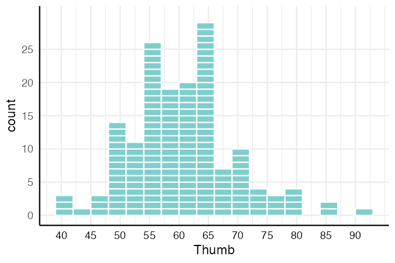
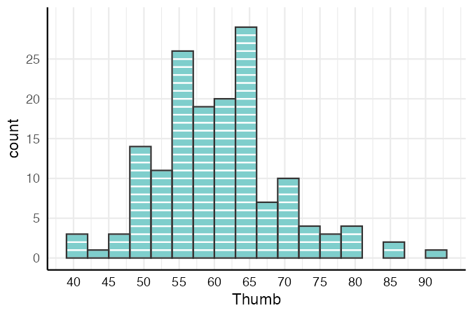
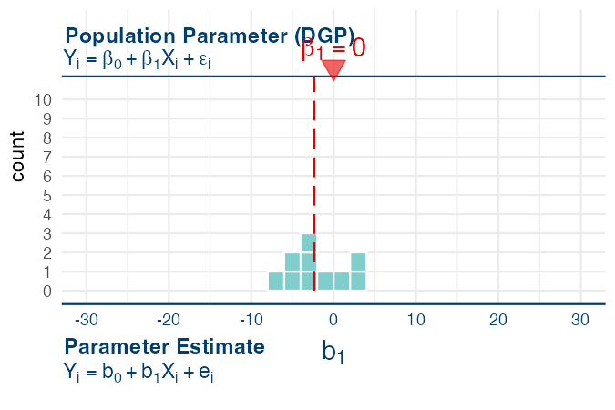
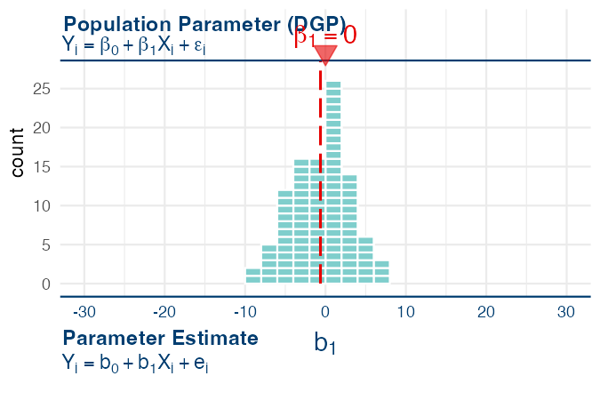

# `gf_squareplot()` — Countable Histogram

**Source:** [`library(coursekata)`](https://github.com/coursekata/coursekata-r) — graduated from beta.

---

## What it does

`gf_squareplot()` is a countable histogram: each observation is shown as a small stacked rectangle instead of an abstract bar. Students can literally count the squares in each bin, making sample size and distribution shape concrete.

It's especially useful for sampling distributions where n is 50–100 — small enough that individual observations matter. A `show_dgp` overlay adds dual axes and a null-hypothesis marker for teaching hypothesis testing.

---

## Usage

```r
library(coursekata)

gf_squareplot(~ Thumb, data = Fingers, binwidth = 3)
```

---

## Examples

### Basic countable histogram

```r
library(coursekata)

gf_squareplot(~ Thumb, data = Fingers, binwidth = 3)
```



*What to look for:* Each square is one observation. Students can count squares per bin directly — no abstract "bar height = count" interpretation needed.

---

### With bar outlines

```r
gf_squareplot(~ Thumb, data = Fingers, bars = "outline", binwidth = 3)
```



*What to look for:* The outlines visually group the squares into histogram bars, helping students see the connection to a canonical histogram while still being able to count individual observations.

---

### Sampling distribution with DGP overlay (small n)

```r
sdob1 <- do(10) * b1(shuffle(time) ~ bucket, data = df)

gf_squareplot(~ b1, data = sdob1,
  show_dgp  = TRUE,
  show_mean = TRUE,
  xrange    = c(-30, 30),
  mincount  = 10,
  binwidth  = 2)
```



*What to look for:* The top axis shows the population parameter (β₁ = 0, marked with a red triangle); the bottom axis shows b₁ sample estimates. With only 10 shuffles, the mean of the distribution (dashed red line) is far from β₁ = 0 — that's the point. Set `mincount = 10` so the axis stays fixed when you scale up.

---

### Sampling distribution with DGP overlay (larger n)

```r
sdob1 <- do(100) * b1(shuffle(time) ~ bucket, data = df)

gf_squareplot(~ b1, data = sdob1,
  show_dgp  = TRUE,
  show_mean = TRUE,
  xrange    = c(-30, 30),
  mincount  = 10,
  binwidth  = 2)
```



*What to look for:* With 100 shuffles the mean of the sampling distribution moves much closer to β₁ = 0. The fixed `mincount = 10` keeps the y-axis the same as the 10-shuffle version, so students can directly compare the two plots.

---

## Arguments

### Data and appearance

| Argument | Default | Description |
|---|---|---|
| `x` | *(required)* | Formula `~variable` or a numeric vector. |
| `data` | *(required for formula)* | Data frame. |
| `fill` | `"#7fcecc"` | Rectangle fill color. |
| `alpha` | `1` | Transparency (0–1). |
| `bars` | `"none"` | `"none"` — squares only; `"outline"` — adds bar borders; `"solid"` — filled bars (standard histogram). |

### Binning

| Argument | Default | Description |
|---|---|---|
| `binwidth` | auto | Width of each bin. |
| `origin` | auto | Where binning starts. |
| `boundary` | — | Alternative to `origin`; sets a bin boundary position. |

### Axis control

| Argument | Default | Description |
|---|---|---|
| `xbreaks` | auto | Number of breaks (approximate, via `pretty()`) or a specific vector of positions. |
| `xrange` | auto | x-axis limits as `c(min, max)`. |
| `mincount` | — | Minimum y-axis height. Use to keep the y-axis fixed when comparing multiple plots at different sample sizes. |

### DGP overlay

| Argument | Default | Description |
|---|---|---|
| `show_dgp` | `FALSE` | If `TRUE`, adds dual axes (Population Parameter / Parameter Estimate), the model equations in Greek and Roman letters, and a red triangle at 0 marking the null hypothesis. |
| `show_mean` | `FALSE` | If `TRUE`, draws a dashed red line at the mean of the distribution. |

---

## Teaching tips

- Countable squares make abstract concepts concrete — students can see that "n = 47" means 47 actual squares.
- Use `mincount` when comparing sampling distributions at different n so the y-axis stays fixed across plots.
- The DGP overlay explicitly distinguishes β (population, unknown) from b (sample estimate, observable) — a distinction worth reinforcing repeatedly.
- Warning messages are automatically suppressed so the classroom display stays clean.
- For samples over 1000, the function automatically switches to `bars = "solid"` — individual squares become too small to count anyway.

---

## How it fits with the other functions

`gf_squareplot()` is most often used for sampling distributions built with `do()` and `shuffle()` or `resample()`. It pairs naturally with `show_cutoffs()` for highlighting p-values:

```r
sdob1 <- do(100) * b1(shuffle(time) ~ bucket, data = df)

gf_squareplot(~ b1, data = sdob1, show_dgp = TRUE, binwidth = 2) %>%
  show_cutoffs(obs_b1, tails = "both")
```

See also:

- [`gf_shuffle_grid.md`](gf_shuffle_grid.md) — "spot the real data" randomization display
- [`gf_coef.md`](gf_coef.md) — labels b0, b1 … on a regression plot
