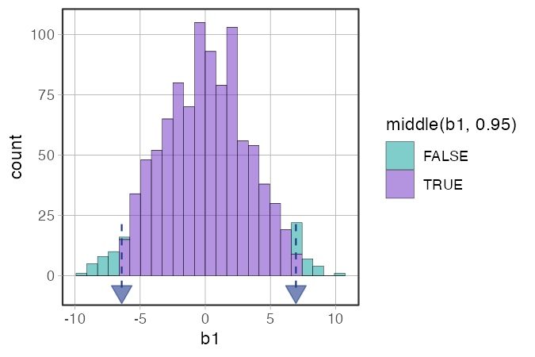
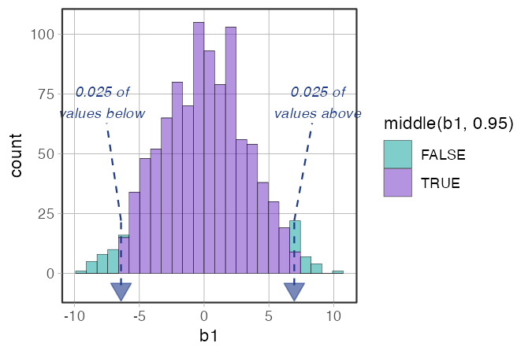
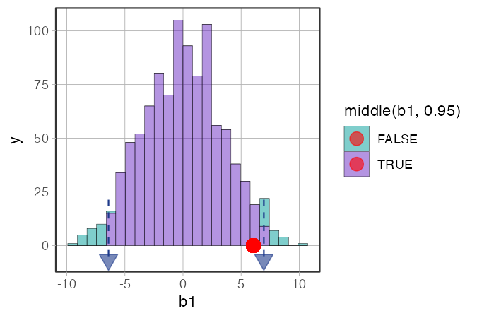
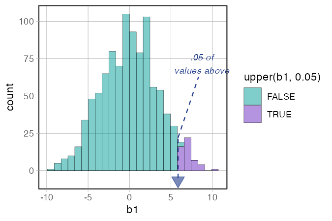
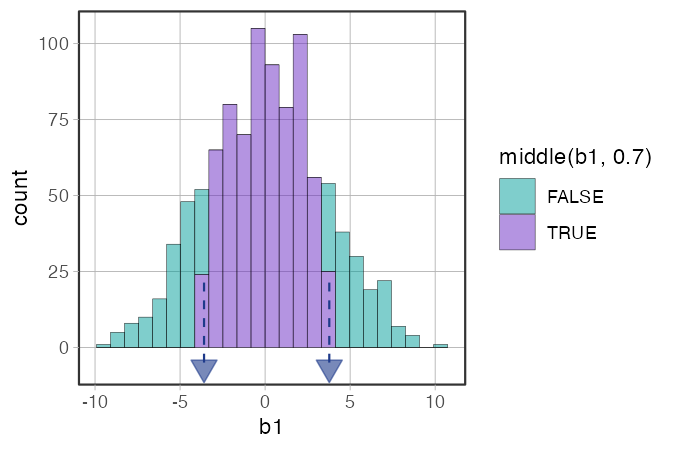

# `show_cutoffs()` — Mark Cutoffs on a Sampling Distribution

**Source:** [`library(coursekata)`](https://github.com/coursekata/coursekata-r) — graduated from beta.

---

## What it does

`show_cutoffs()` adds dashed vertical lines and downward-pointing triangle markers at the empirical quantile cutoffs on a histogram that uses a distribution-part function in its fill aesthetic.

It is always used together with one of the distribution-part functions — `middle()`, `tails()`, `upper()`, `lower()`, or `outer()` — which color the histogram bins. `show_cutoffs()` then makes the boundaries between those colored regions explicit with visible markers.

The typical workflow:

```r
gf_histogram(~ b1, data = sdob1, fill = ~ middle(b1, .95)) %>%
  show_cutoffs()
```

---

## The distribution-part functions

Before using `show_cutoffs()`, you need to understand the fill functions it works with. Each one colors histogram bins based on where they fall relative to a cutoff:

| Function | Colors… | Typical use |
|---|---|---|
| `middle(x, prop)` | the central `prop` of values | highlight the "likely" region; shade the two tails |
| `tails(x, prop)` | the outer `prop` of values (both tails combined) | highlight the "unlikely" region |
| `upper(x, prop)` | the top `prop` of values | one-tailed upper test |
| `lower(x, prop)` | the bottom `prop` of values | one-tailed lower test |
| `outer(x, prop)` | each tail gets `prop/2` of values | same as `tails()` with different framing |

All of these are used as `fill = ~ middle(variable, proportion)` inside `gf_histogram()`.

---

## Usage

```r
library(coursekata)

# Build sampling distribution
sdob1 <- do(1000) * b1(shuffle(Tip) ~ Condition, data = TipExperiment)

# Color the middle 95%; mark the cutoffs
gf_histogram(~ b1, data = sdob1, fill = ~ middle(b1, .95)) %>%
  show_cutoffs()
```

---

## Examples

### Middle 95% with cutoff markers

```r
library(coursekata)

set.seed(42)
sdob1 <- do(1000) * b1(shuffle(Tip) ~ Condition, data = TipExperiment)

gf_histogram(~ b1, data = sdob1, fill = ~ middle(b1, .95)) %>%
  show_cutoffs()
```



*What to look for:* The two colored regions are the most extreme 5% of shuffled b1 values — the region we've agreed (using α = .05) to call "unlikely." The dashed lines and triangles mark exactly where the middle 95% ends and the tails begin.

---

### With labels

```r
gf_histogram(~ b1, data = sdob1, fill = ~ middle(b1, .95)) %>%
  show_cutoffs(labels = TRUE)
```



*What to look for:* `labels = TRUE` adds text annotations showing what proportion of values fall beyond each cutoff. Useful in classroom presentations where you want to be explicit about what the tail proportions are.

---

### Overlaying the observed b1

```r
obs_b1 <- b1(Tip ~ Condition, data = TipExperiment)

gf_histogram(~ b1, data = sdob1, fill = ~ middle(b1, .95)) %>%
  show_cutoffs() %>%
  gf_point(0 ~ obs_b1, color = "red", size = 4)
```



*What to look for:* The red dot is the b1 we actually observed in the data. If it falls in the shaded tail region (beyond the cutoff markers), we say the result is "statistically unlikely" under the empty model. If it's inside the middle region, we don't have enough evidence to reject the empty model.

---

### One-tailed: upper

```r
gf_histogram(~ b1, data = sdob1, fill = ~ upper(b1, .05)) %>%
  show_cutoffs(labels = TRUE)
```



*What to look for:* Only the top 5% is shaded — appropriate when you have a directional hypothesis (e.g., you predicted the treatment group would have *higher* tips). Only one cutoff marker appears.

---

### Changing the alpha level

```r
gf_histogram(~ b1, data = sdob1, fill = ~ middle(b1, .70)) %>%
  show_cutoffs()
```



*What to look for:* Setting `middle(b1, .70)` means the outer 30% is shaded — a much more lenient alpha of .30. The cutoff markers move inward, and a much larger portion of the sampling distribution is now considered "unlikely." This is a useful classroom exercise for showing students why the community settled on α = .05 rather than something more or less strict.

---

## Arguments

| Argument | Default | Description |
|---|---|---|
| `plot` | *(required)* | A ggplot histogram with `fill` set to a distribution-part function. |
| `color` | `"#1e3a8a"` | Color of the marker triangles, dashed lines, and labels. |
| `size` | `4` | Size of the downward-pointing triangle markers. |
| `labels` | `FALSE` | If `TRUE`, adds text annotations showing the tail proportion at each cutoff. |

---

## Teaching tips

- Introduce the `middle()` fill pattern *before* `show_cutoffs()`. Students should first understand that the colored regions represent "likely" vs. "unlikely" outcomes under the empty model. `show_cutoffs()` then makes the boundary precise.
- Use `gf_point(0 ~ obs_b1, color = "red", size = 4)` after `show_cutoffs()` to overlay the observed statistic. The spatial relationship between the dot and the cutoff is the visual argument for or against the empty model.
- The `labels = TRUE` option works well in projected classroom settings where you want students to be able to read off the tail proportion without doing mental math.
- The `middle()` and `tails()` functions are complementary framings of the same idea: `middle(b1, .95)` colors what's *likely*; `tails(b1, .05)` colors what's *unlikely*. Showing students both framings helps reinforce that they're two ways of describing the same cutoffs.

---

## How it fits with the other functions

`show_cutoffs()` sits at the end of the sampling distribution workflow:

```r
# 1. Build the sampling distribution
sdob1 <- do(1000) * b1(shuffle(Tip) ~ Condition, data = TipExperiment)

# 2. Visualize it with colored regions
gf_histogram(~ b1, data = sdob1, fill = ~ middle(b1, .95)) %>%

# 3. Mark the cutoffs explicitly
  show_cutoffs(labels = TRUE) %>%

# 4. Overlay the observed statistic
  gf_point(0 ~ obs_b1, color = "red", size = 4)
```

See also:

- [`gf_squareplot.md`](gf_squareplot.md) — countable histogram used earlier in the sampling distribution sequence
- [`gf_shuffle_grid.md`](gf_shuffle_grid.md) — "spot the real data" display used to introduce the logic of randomization
